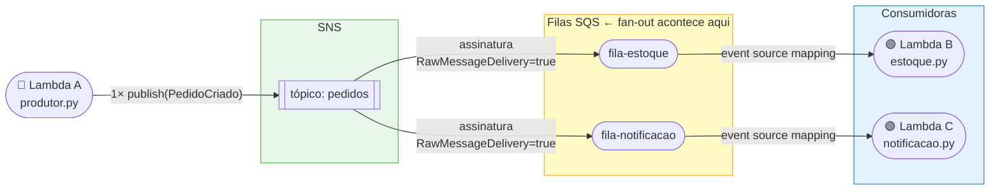
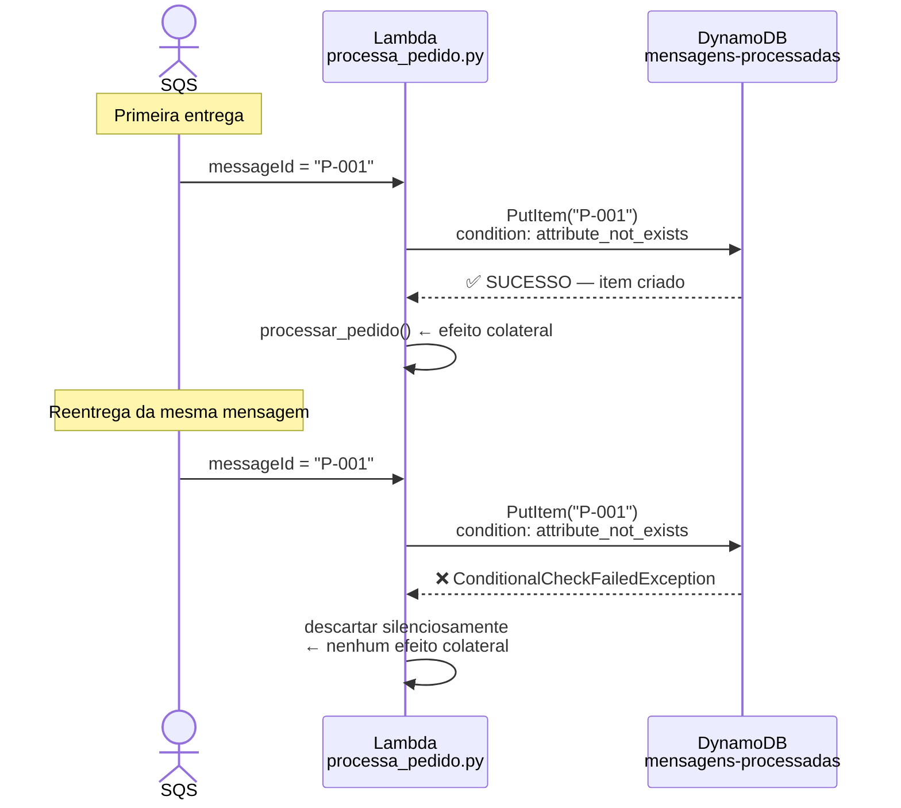
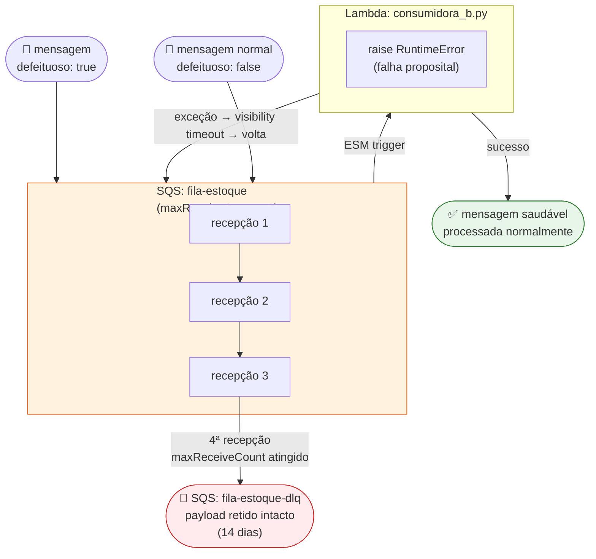

# Serverless Event-Driven — Demos Educacionais

Projeto de código para as demos U1V7, U1V8 e U1V9 do curso **IEC EAD — Serverless Computing e Arquiteturas Event-Driven** (PUC Minas / IEC).

Cada demo é executável localmente via LocalStack ou na AWS Real, **sem nenhuma mudança de código** — apenas variáveis de ambiente.

---

## As três demos

| Demo | Padrão | Serviços |
|---|---|---|
| **U1V7** | Fan-out pub/sub | SNS → SQS → Lambda |
| **U1V8** | Idempotência at-least-once | SQS → Lambda → DynamoDB |
| **U1V9** | Dead-Letter Queue | SQS + DLQ → Lambda |

---

### U1V7 — Fan-out

> Uma publicação no SNS se desdobra em duas filas SQS independentes. O produtor não conhece as filas — conhece apenas o tópico.



---

### U1V8 — Idempotência

> O SQS entrega *at-least-once*: a mesma mensagem pode chegar duas vezes. O `PutItem` condicional garante que o efeito colateral aconteça exatamente uma vez.



---

### U1V9 — Dead-Letter Queue

> Uma *poison message* falha 3 vezes consecutivas e é roteada para a DLQ. A fila principal continua processando as demais mensagens normalmente.



---

## Pré-requisitos

| Ferramenta | Versão | Para quê |
|---|---|---|
| Docker | recente | Subir o LocalStack |
| Python | 3.12 | Rodar os testes |
| make | qualquer | Atalhos de comando (pré-instalado no Mac via Xcode CLI Tools) |
| AWS CLI v2 | recente | Inspecionar recursos via terminal |
| SAM CLI | recente | Deploy na AWS Real (opcional) |

> `boto3` e `pytest` são instalados via `pip install -r requirements.txt`.

> **Mac:** `make` já vem com o Xcode Command Line Tools. Se não tiver instalado: `xcode-select --install`. Para verificar: `make --version`.

---

## Quick Start (modo local)

```bash
# 1. Clonar e instalar dependências
git clone <url>
cd serverless-event-driven
pip install -r requirements.txt

# 2. Subir o LocalStack
make up

# 3. Rodar todas as demos
make test

# Ou rodar uma demo por vez:
make test-v7   # fan-out
make test-v8   # idempotência
make test-v9   # DLQ (~2 min — aguarda 3 ciclos de retry)

# 4. Inspecionar recursos criados
export AWS_ENDPOINT_URL=http://localhost:4566
aws --endpoint-url=$AWS_ENDPOINT_URL sns list-topics
aws --endpoint-url=$AWS_ENDPOINT_URL sqs list-queues

# 5. Limpar
make clean
```

---

## Estrutura do projeto

```
serverless-event-driven/
├── src/
│   ├── U1V7_fanout/           # Handlers da demo fan-out
│   │   ├── produtor.py        # Lambda A — publica no SNS
│   │   ├── estoque.py         # Lambda B — consome fila-estoque
│   │   └── notificacao.py     # Lambda C — consome fila-notificacao
│   ├── U1V8_idempotencia/
│   │   └── processa_pedido.py # PutItem condicional (idempotência)
│   └── U1V9_dlq/
│       └── consumidora_b.py   # Falha proposital → ciclo DLQ
├── infra/
│   ├── template.yaml          # SAM — infraestrutura como código
│   └── scripts/
│       ├── setup.sh           # Provisiona recursos no LocalStack
│       ├── teardown.sh        # Remove recursos
│       └── wait-localstack.sh # Health check (polling, nunca sleep)
├── tests/
│   ├── helpers.py             # wait_until, deploy_lambda, make_client
│   ├── conftest.py            # Fixtures de sessão
│   ├── test_U1V7_fanout.py
│   ├── test_U1V8_idempotencia.py
│   └── test_U1V9_dlq.py
└── docs/
    ├── architecture/
    │   ├── README.md          # Diagramas Mermaid (C4, flowchart, sequence)
    │   └── adrs/              # Decisões arquiteturais (ADR-001 a ADR-003)
    └── roteiros/              # Guias passo a passo por demo
```

---

## Modo AWS Real

```bash
# Remover a variável de endpoint e usar credenciais reais
unset AWS_ENDPOINT_URL
aws configure  # ou exportar AWS_ACCESS_KEY_ID / AWS_SECRET_ACCESS_KEY

# Deploy via SAM
make deploy-aws
```

---

## Padrões adotados

### `wait_until` em vez de `time.sleep`

Todos os testes usam polling com timeout. Nunca `time.sleep` fixo.

```python
# ✅ Correto — espera até a condição ser verdadeira (ou timeout)
wait_until(lambda: mensagem_na_dlq(), timeout=90)

# ❌ Evitar — sleep fixo torna o teste lento OU frágil
time.sleep(30)
```

### `endpoint_url=os.environ.get("AWS_ENDPOINT_URL")`

Todos os clientes boto3 leem `AWS_ENDPOINT_URL`. Quando a variável não está definida, `endpoint_url=None` é ignorado pelo boto3 — o cliente usa a AWS real. Zero mudança de código entre modos.

### Infraestrutura como código

Toda a topologia está declarada em `infra/template.yaml`. O fan-out (1 tópico → 2 assinaturas), a DLQ (RedrivePolicy) e o TTL (TimeToLiveSpecification) estão visíveis como código, não como cliques no console.

---

## Comandos disponíveis

```
make help
```

---

## Referências

- [Roteiro U1V7 — Fan-out](docs/roteiros/U1V7-fan-out.md)
- [Roteiro U1V8 — Idempotência](docs/roteiros/U1V8-idempotencia.md)
- [Roteiro U1V9 — DLQ](docs/roteiros/U1V9-dlq.md)
- [Arquitetura e Diagramas](docs/architecture/README.md)
- [ADRs](docs/architecture/adrs/)
- [aspire-aws](https://github.com/arkhibr/aspire-aws) — projeto de referência (padrões LocalStack)
