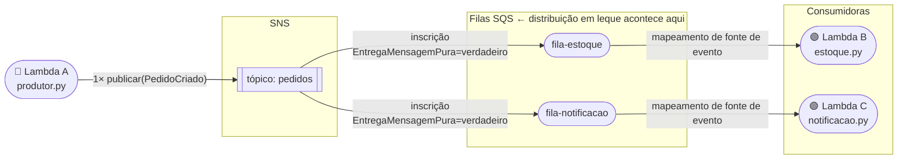
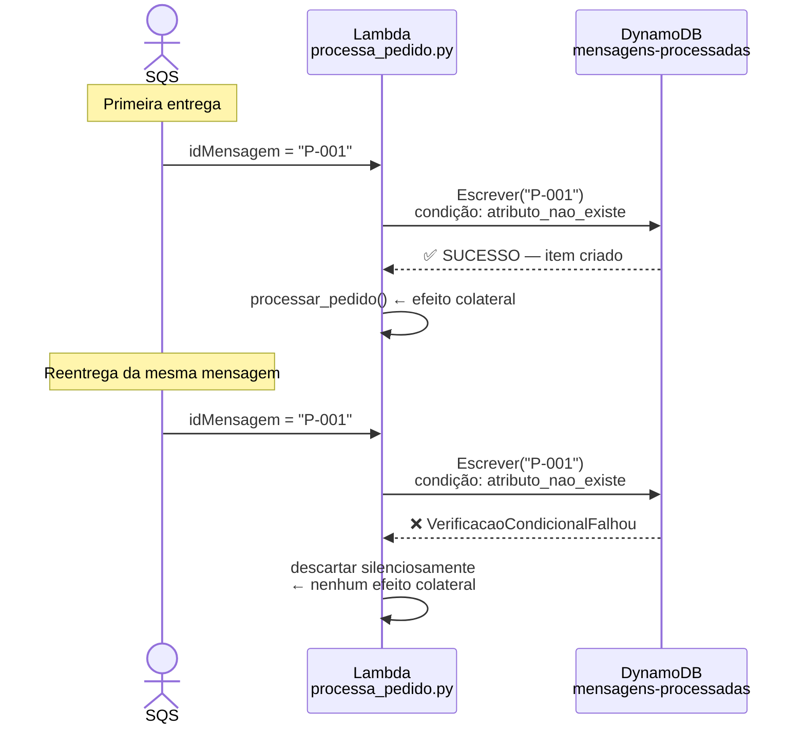
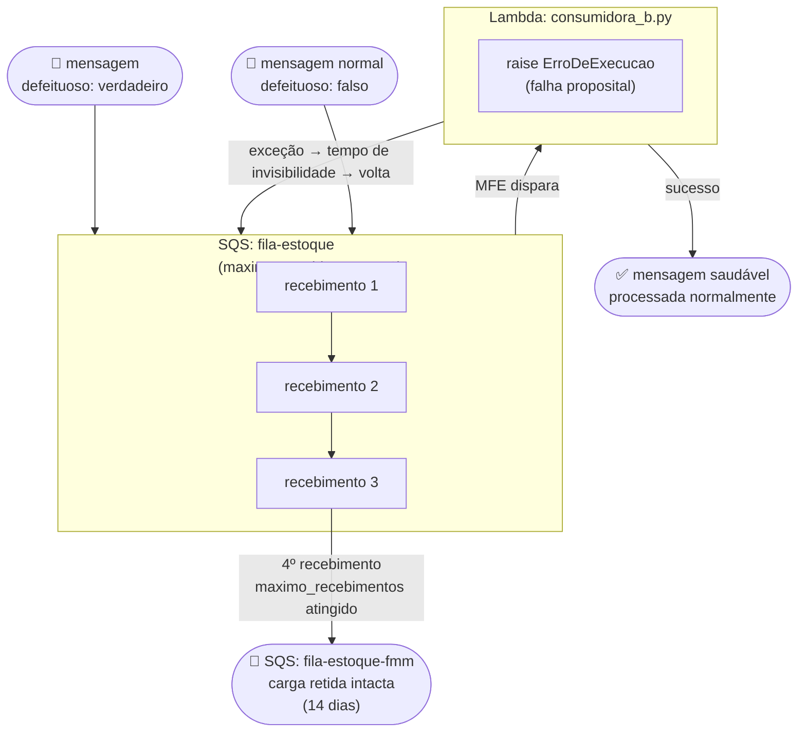

# Serverless Event-Driven — Demos Educacionais

Projeto de código para as demos U1V7, U1V8 e U1V9 do curso **IEC EAD — Serverless Computing e Arquiteturas Event-Driven** (PUC Minas / IEC).

> 📚 **Portal de documentação:** comece por [docs/index.md](docs/index.md) — trilha didática do zero ao entendimento do código.

Cada demo é executável localmente via LocalStack ou na AWS Real, **sem nenhuma mudança de código** — apenas variáveis de ambiente.

---

## As três demonstrações

| Demo | Padrão | Serviços |
|---|---|---|
| **U1V7** | Distribuição em leque publicar/inscrever | SNS → SQS → Lambda |
| **U1V8** | Idempotência pelo menos uma vez | SQS → Lambda → DynamoDB |
| **U1V9** | Fila de Mensagens Mortas | SQS + FMM → Lambda |

---

### U1V7 — Distribuição em Leque

> Uma publicação no SNS se desdobra em duas filas SQS independentes. O produtor não conhece as filas — conhece apenas o tópico.



---

### U1V8 — Idempotência

> O SQS entrega *pelo menos uma vez*: a mesma mensagem pode chegar duas vezes. A escrita condicional garante que o efeito colateral aconteça exatamente uma vez.



---

### U1V9 — Fila de Mensagens Mortas

> Uma mensagem venenosa falha 3 vezes consecutivas e é roteada para a FMM. A fila principal continua processando as demais mensagens normalmente.



---

## Pré-requisitos

| Ferramenta | Versão | Para quê |
|---|---|---|
| Docker | recente | Subir o LocalStack |
| Python | 3.12 | Rodar os testes |
| make | qualquer | Atalhos de comando (pré-instalado no Mac via Xcode CLI Tools) |
| AWS CLI v2 | recente | Inspecionar recursos via terminal |
| SAM CLI | recente | Deploy na AWS Real (opcional) |

> `boto3` e `pytest` são instalados via `pip install -r requirements.txt`.

> **Mac:** `make` já vem com o Xcode Command Line Tools. Se não tiver instalado: `xcode-select --install`. Para verificar: `make --version`.

---

## Quick Start (modo local)

```bash
# 1. Clonar o repositório
git clone <url>
cd serverless-event-driven

# 2. Criar ambiente virtual e instalar dependências
python3 -m venv .venv
source .venv/bin/activate      # Mac/Linux
# .venv\Scripts\activate       # Windows

pip install -r requirements.txt

# 3. Subir o LocalStack
make up

# 4. Rodar todas as demos
make test

# Ou rodar uma demo por vez:
make test-v7   # fan-out
make test-v8   # idempotência
make test-v9   # DLQ (~2 min — aguarda 3 ciclos de retry)

# 5. Inspecionar recursos criados
export AWS_ENDPOINT_URL=http://localhost:4566
aws --endpoint-url=$AWS_ENDPOINT_URL sns list-topics
aws --endpoint-url=$AWS_ENDPOINT_URL sqs list-queues

# 6. Limpar
make clean
```

> **Lembrete:** sempre ative o ambiente virtual antes de rodar os testes (`source .venv/bin/activate`). O prompt do terminal mostrará `(.venv)` quando estiver ativo.

---

## Estrutura do projeto

```
serverless-event-driven/
├── src/
│   ├── U1V7_fanout/           # Gerenciadores da demo distribuição em leque
│   │   ├── produtor.py        # Lambda A — publica no SNS
│   │   ├── estoque.py         # Lambda B — consome fila-estoque
│   │   └── notificacao.py     # Lambda C — consome fila-notificacao
│   ├── U1V8_idempotencia/
│   │   └── processa_pedido.py # Escrita condicional (idempotência)
│   └── U1V9_dlq/
│       └── consumidora_b.py   # Falha proposital → ciclo FMM
├── infra/
│   ├── template.yaml          # Modelo SAM — infraestrutura como código
│   └── scripts/
│       ├── setup.sh           # Provisiona recursos no LocalStack
│       ├── teardown.sh        # Remove recursos
│       └── wait-localstack.sh # Verificação de saúde (varredura, nunca suspensão)
├── tests/
│   ├── helpers.py             # esperar_até, implantar_lambda, criar_cliente
│   ├── conftest.py            # Acessórios de sessão
│   ├── test_U1V7_fanout.py
│   ├── test_U1V8_idempotencia.py
│   └── test_U1V9_dlq.py
└── docs/
    ├── architecture/
    │   ├── README.md          # Diagramas Mermaid (C4, gráfico de fluxo, sequência)
    │   └── adrs/              # Decisões arquiteturais (ADR-001 a ADR-003)
    └── index.md               # Portal de documentação — trilha didática
```

---

## Modo AWS Real

```bash
# Remover a variável de endpoint e usar credenciais reais
unset AWS_ENDPOINT_URL
aws configure  # ou exportar AWS_ACCESS_KEY_ID / AWS_SECRET_ACCESS_KEY

# Deploy via SAM
make deploy-aws
```

---

## Padrões adotados

### `esperar_até` em vez de `time.sleep`

Todos os testes usam varredura com tempo limite. Nunca suspensão fixa.

```python
# ✅ Correto — espera até a condição ser verdadeira (ou tempo limite)
esperar_até(lambda: mensagem_na_fmm(), timeout=90)

# ❌ Evitar — suspensão fixa torna o teste lento OU frágil
time.sleep(30)
```

### `endpoint_url=os.environ.get("AWS_ENDPOINT_URL")`

Todos os clientes boto3 leem `AWS_ENDPOINT_URL`. Quando a variável não está definida, `endpoint_url=None` é ignorado pelo boto3 — o cliente usa a AWS real. Zero mudança de código entre modos.

### Infraestrutura como código

Toda a topologia está declarada em `infra/template.yaml`. A distribuição em leque (1 tópico → 2 inscrições), a FMM (PolíticaReenvio) e o TTL (EspecificacaoDeTempoParaViver) estão visíveis como código, não como cliques no console.

---

## Comandos disponíveis

```
make help
```

---

## Referências

- [Demo U1V7 — Fan-out](docs/02-demos/u1v7-fan-out.md)
- [Demo U1V8 — Idempotência](docs/02-demos/u1v8-idempotencia.md)
- [Demo U1V9 — DLQ](docs/02-demos/u1v9-dlq.md)
- [aws_builder.py — Padrão de Infraestrutura Educacional](docs/03-aprofundar/aws-builder.md)
- [Arquitetura e Diagramas](docs/architecture/README.md)
- [ADRs](docs/architecture/adrs/)
- [aspire-aws](https://github.com/arkhibr/aspire-aws) — projeto de referência (padrões LocalStack)
