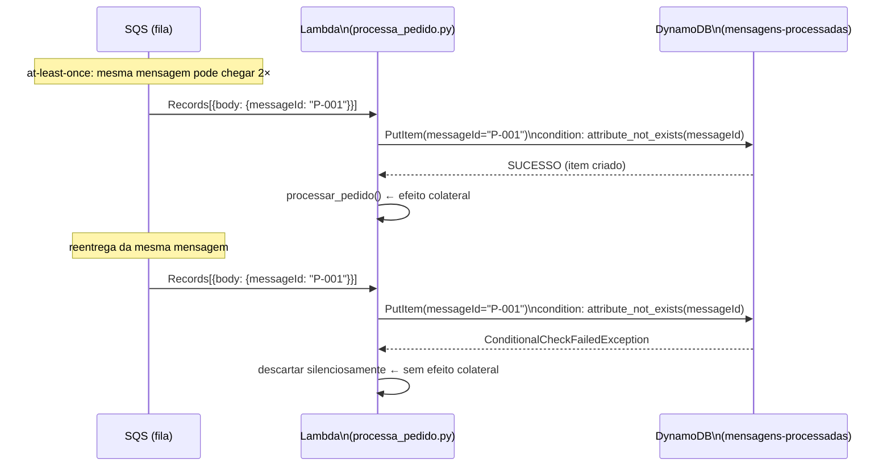

# U1V8 — Idempotência com DynamoDB

## 1. Objetivo de aprendizagem

Ao terminar esta aula você vai entender **por que** o [SQS](../glossario.md#sqs) pode entregar a mesma mensagem mais de uma vez e **como** usar um `PutItem` condicional no DynamoDB para garantir que cada `messageId` seja processado exatamente uma vez, mesmo sob entrega *at-least-once*.

**Pré-requisitos:**
- [Os Quatro Serviços](../01-fundamentos/3-os-quatro-servicos.md) — SQS: entrega *at-least-once*, visibilidade de mensagem
- [Serverless e Lambda](../01-fundamentos/1-serverless-e-lambda.md) — `lambda_handler`, ciclo de invocação

---

## 2. O problema: SQS é at-least-once

O [SQS](../glossario.md#sqs) garante que sua mensagem *será* entregue, mas não garante que será entregue *uma única vez*. Um timeout de visibilidade, uma falha de rede ou um retry automático pode fazer a mesma mensagem chegar duas vezes para a sua Lambda.

Sem proteção, isso significa:
- **Cobrança dupla** — o pedido do cliente é debitado duas vezes.
- **E-mail duplicado** — o cliente recebe o mesmo e-mail de confirmação duas vezes.
- **Baixa de estoque incorreta** — o mesmo item é removido do estoque duas vezes.

A propriedade que evita esses efeitos se chama **idempotência**: processar a mesma mensagem *N* vezes produz o mesmo resultado que processar uma única vez.

---

## 3. Solução em diagrama



O ponto-chave do diagrama: a Lambda **tenta reivindicar o `messageId` no DynamoDB antes de executar qualquer efeito colateral**. Só se a reivindicação for bem-sucedida o pedido é processado.

---

## 4. Código real explicado

```python
"""
Lambda — Processa Pedido com Idempotência (U1V8)

Consome mensagens SQS e grava o pedido no DynamoDB.
Usa PutItem condicional para garantir que cada messageId é processado
exatamente uma vez, mesmo sob entrega at-least-once do SQS.

Pegadinha clássica: GetItem + PutItem tem condição de corrida.
A versão correta usa attribute_not_exists(messageId) numa operação atômica.
"""
import boto3
import json
import os
import time

from botocore.exceptions import ClientError

_dynamo = boto3.resource("dynamodb", endpoint_url=os.environ.get("AWS_ENDPOINT_URL"))
_table = _dynamo.Table(os.environ.get("DYNAMODB_TABLE", "mensagens-processadas"))


def lambda_handler(event, context):
    for record in event["Records"]:
        pedido = json.loads(record["body"])
        message_id = pedido["messageId"]

        # Checagem ANTES do efeito colateral — essa ordem é invariável.
        if not _reivindicar(message_id):
            print(f"[IDEMPOTENCIA] Duplicata descartada: {message_id}")
            continue

        _processar_pedido(pedido)


def _reivindicar(message_id: str) -> bool:
    """
    Tenta registrar o messageId atomicamente.
    Retorna True se for a primeira vez; False se for duplicata.

    Usa PutItem com ConditionExpression para garantir atomicidade.
    Isso elimina a condição de corrida que existiria com GetItem + PutItem separados:

        Invocação A: get_item → "não existe"
        Invocação B: get_item → "não existe"   ← B leu antes de A gravar
        Invocação A: put_item → grava
        Invocação B: put_item → grava (sobrescreve) → DUPLICATA!

    Com a versão atômica:
        A: put_item condicional → SUCESSO → processa
        B: put_item condicional → ConditionalCheckFailedException → descarta
    """
    agora = int(time.time())
    expira_em = agora + 86_400  # TTL: 24h em segundos epoch

    try:
        _table.put_item(
            Item={
                "messageId": message_id,
                "processado_em": agora,
                "expira_em": expira_em,
            },
            # Grava SOMENTE se o messageId ainda não existir — operação atômica no servidor.
            ConditionExpression="attribute_not_exists(messageId)",
        )
        return True  # Reivindiquei o ID → posso processar
    except ClientError as e:
        if e.response["Error"]["Code"] == "ConditionalCheckFailedException":
            return False  # Já existia → duplicata
        raise


def _processar_pedido(pedido: dict) -> None:
    """Efeito colateral de negócio. Só é chamado para mensagens novas."""
    print(f"[NEGOCIO] Processando pedido: {pedido['messageId']}")
```

### Fluxo de execução

**`lambda_handler`** é o ponto de entrada. Para cada `record` no lote [SQS](../glossario.md#sqs), ele extrai o `messageId` e chama `_reivindicar()` **antes** de qualquer efeito colateral. Se `_reivindicar()` retornar `False`, o loop continua para o próximo registro com `continue` — o pedido não é processado.

**`_reivindicar(message_id)`** faz uma única chamada ao DynamoDB (`put_item`) com `ConditionExpression="attribute_not_exists(messageId)"`. Se o item não existe ainda, o DynamoDB o cria e retorna sucesso → `True`. Se já existe, o DynamoDB lança `ConditionalCheckFailedException` → `False`.

**`_processar_pedido(pedido)`** só é chamada quando `_reivindicar()` retornou `True`. Neste código didático ela apenas imprime; em produção seria aqui que vive o efeito colateral de negócio (debitar cartão, enviar e-mail, baixar estoque).

**A ordem importa**: reivindicar → processar. Inverter essa ordem (processar → reivindicar) quebraria a garantia: se a Lambda falhar entre o processamento e a gravação, o `messageId` nunca seria registrado e a mensagem seria processada novamente no próximo retry.

---

## 5. O ponto de atenção da race condition

A docstring de `_reivindicar` mostra por que a abordagem ingênua com `GetItem + PutItem` separados não funciona:

```
Invocação A: get_item → "não existe"
Invocação B: get_item → "não existe"   ← B leu antes de A gravar
Invocação A: put_item → grava
Invocação B: put_item → grava (sobrescreve) → DUPLICATA!
```

Ambas as invocações leram "não existe" antes de qualquer uma gravar. Resultado: dois processamentos.

Com `ConditionExpression="attribute_not_exists(messageId)"`, a condição e a gravação são **uma única operação atômica executada no servidor do DynamoDB**:

```
A: put_item condicional → SUCESSO → processa
B: put_item condicional → ConditionalCheckFailedException → descarta
```

O DynamoDB garante que apenas uma das duas invocações vence. A outra recebe a exceção e descarta silenciosamente. Não importa se A e B chegaram ao DynamoDB ao mesmo tempo — o servidor serializa a decisão.

---

## 6. Infraestrutura

A tabela e a função estão declaradas em `infra/template.yaml`:

```yaml
  TabelaMensagensProcessadas:
    Type: AWS::DynamoDB::Table
    Properties:
      TableName: mensagens-processadas
      BillingMode: PAY_PER_REQUEST
      AttributeDefinitions:
        - AttributeName: messageId
          AttributeType: S
      KeySchema:
        - AttributeName: messageId
          KeyType: HASH
      TimeToLiveSpecification:
        AttributeName: expira_em
        Enabled: true

  ProcessaPedidoFunction:
    Type: AWS::Serverless::Function
    Properties:
      FunctionName: processa-pedido
      Handler: processa_pedido.lambda_handler
      CodeUri: ../src/U1V8_idempotencia/
      Environment:
        Variables:
          DYNAMODB_TABLE: !Ref TabelaMensagensProcessadas
      Policies:
        - DynamoDBCrudPolicy:
            TableName: !Ref TabelaMensagensProcessadas
```

Pontos importantes da infraestrutura:

- **Chave primária**: `messageId` (tipo `S` — String), `KeyType: HASH`. Não há sort key — o `messageId` identifica unicamente cada registro de controle.
- **[TTL](../glossario.md#ttl)**: `AttributeName: expira_em`, `Enabled: true`. O DynamoDB apaga automaticamente os registros após o timestamp Unix configurado no campo `expira_em`. Sem isso, a tabela cresceria indefinidamente — cada mensagem processada deixaria um registro para sempre.
- **`BillingMode: PAY_PER_REQUEST`**: cobrança por operação, sem capacidade provisionada. Adequado para cargas variáveis.
- **`DynamoDBCrudPolicy`**: política gerenciada do SAM que concede `GetItem`, `PutItem`, `UpdateItem`, `DeleteItem`, `BatchGetItem`, `BatchWriteItem`, `Query`, `Scan` na tabela. O `PutItem` condicional está incluído.

---

## 7. Rodar e observar

Execute os testes da demo com:

```bash
make test-v8
```

Os 4 testes cobrem os cenários essenciais:

| Teste | O que verifica |
|-------|---------------|
| `test_primeira_entrega_processa_e_registra_no_dynamodb` | Caminho feliz: mensagem nova é processada e o `messageId` aparece na tabela de controle |
| `test_segunda_entrega_do_mesmo_pedido_e_ignorada` | Duas entregas do mesmo `messageId` → exatamente 1 registro no DynamoDB |
| `test_registro_de_controle_tem_data_de_expiracao` | O campo `expira_em` existe e é um timestamp no futuro (o [TTL](../glossario.md#ttl) vai funcionar) |
| `test_duplicata_nao_gera_erro_na_funcao` | A `ConditionalCheckFailedException` não vaza como `FunctionError` |

Ao rodar `make test-v8`, observe no log:
- `[NEGOCIO] Processando pedido: <id>` — aparece na primeira entrega.
- `[IDEMPOTENCIA] Duplicata descartada: <id>` — aparece na segunda entrega.

---

## 8. Pontos de Atenção

### A `ConditionalCheckFailedException` não pode vazar

O catch em `_reivindicar` é proposital e crítico:

```python
except ClientError as e:
    if e.response["Error"]["Code"] == "ConditionalCheckFailedException":
        return False  # Já existia → duplicata
    raise
```

Se essa exceção vazasse para o `lambda_handler`, a Lambda terminaria com `FunctionError`. O [SQS](../glossario.md#sqs) interpretaria isso como falha de processamento, recolocaria a mensagem na fila e tentaria novamente — repetidamente, até atingir o `maxReceiveCount` da fila e mandar para a [DLQ](../glossario.md#dlq).

Resultado: a mensagem ficaria circulando em loop infinito antes de ir para a [DLQ](../glossario.md#dlq), desperdiçando invocações e gerando alarmes falsos.

A `ConditionalCheckFailedException` **não é um erro de sistema** — é o sinal esperado de "já processamos esse `messageId`". Descartar a duplicata em silêncio (`return False` → `continue`) é o comportamento correto.

### A ordem reivindicar → processar é invariável

Se você inverter — processar o pedido e só depois tentar reivindicar — uma falha entre os dois passos deixa o `messageId` sem registro. Na próxima entrega, a Lambda processaria novamente. Toda a garantia de idempotência estaria quebrada.

### O TTL não apaga no segundo exato

O DynamoDB pode levar até 48 horas após o [TTL](../glossario.md#ttl) para remover o item. Durante essa janela, o item ainda existe e a condição `attribute_not_exists(messageId)` ainda funciona corretamente. Isso é um detalhe de implementação do DynamoDB, não um bug da solução.

---

## 9. Checklist de compreensão

- [ ] Por que o [SQS](../glossario.md#sqs) pode entregar a mesma mensagem mais de uma vez?
- [ ] O que aconteceria se a Lambda processasse o pedido **antes** de reivindicar o `messageId`?
- [ ] Por que `GetItem + PutItem` em duas chamadas separadas não é suficiente para garantir idempotência?
- [ ] O que `attribute_not_exists(messageId)` faz de diferente de uma verificação no código Python?
- [ ] O que acontece se a `ConditionalCheckFailedException` não for tratada internamente?
- [ ] Para que serve o campo `expira_em` e o que acontece se ele não existir?
- [ ] Qual é o papel da [DLQ](../glossario.md#dlq) no contexto de erros que vazam da Lambda?

Exercícios práticos: [../exercicios.md#u1v8](../exercicios.md#u1v8)

---

⬅️ [Anterior: U1V7 — Fan-out com SNS + SQS](u1v7-fan-out.md) · 📑 [Índice](../index.md) · [Próximo: U1V9 — DLQ](u1v9-dlq.md) ➡️
