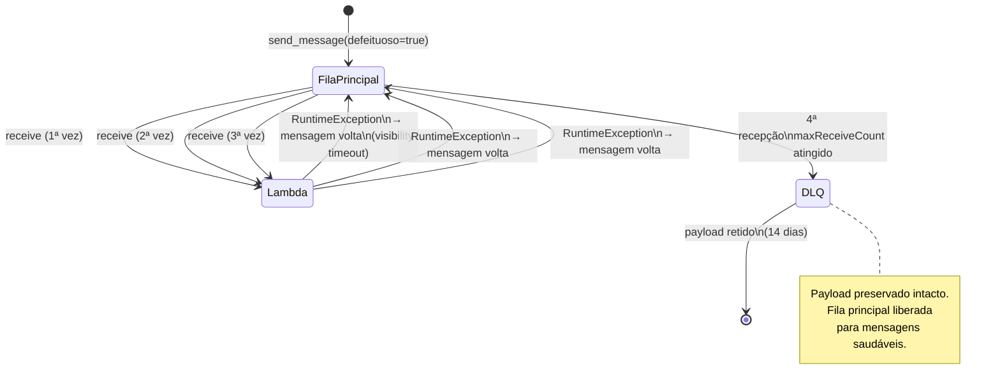

# U1V9 — Dead Letter Queue (DLQ)

## 1. Objetivo de aprendizagem

Ao terminar esta aula você vai entender **por que** uma mensagem "venenosa" pode travar uma fila inteira e **como** a [DLQ](../glossario.md#dlq) isola automaticamente essas mensagens após um número configurável de tentativas, liberando a fila principal para continuar processando.

**Pré-requisitos:**
- [Os Quatro Serviços](../01-fundamentos/3-os-quatro-servicos.md) — SQS: visibility timeout, at-least-once delivery
- [Serverless e Lambda](../01-fundamentos/1-serverless-e-lambda.md) — `lambda_handler`, ciclo de invocação e tratamento de erros

---

## 2. O problema: a mensagem que falha sempre

Imagine que sua Lambda recebe um payload com dados corrompidos. O handler lança uma exceção, o [SQS](../glossario.md#sqs) detecta a falha e devolve a mensagem para a fila — e o ciclo se repete indefinidamente.

Esse tipo de mensagem se chama **mensagem venenosa** (*poison pill*): ela nunca será processada com sucesso no código atual, bloqueia o worker e, dependendo da configuração, pode impedir que mensagens saudáveis sejam entregues.

Sem [DLQ](../glossario.md#dlq):
- A mensagem venenosa fica circulando na fila até o TTL expirar (padrão: 4 dias).
- Enquanto isso, ela continua sendo entregue e descartando recursos de processamento.
- O payload original se perde sem nenhum registro de falha.

---

## 3. Solução em diagrama



---

## 4. Código real explicado

```python
"""
Lambda B — Consumidora de Estoque com DLQ (U1V9)

Consome mensagens da fila-estoque. Rejeita mensagens com flag "defeituoso"
lançando uma exceção que escapa do handler — isso sinaliza ao SQS que
a mensagem NÃO foi processada e não deve ser deletada.

Após maxReceiveCount recepções com falha, o SQS roteia a mensagem para a DLQ.

Para demonstrar o fluxo de correção:
  1. Enviar mensagem com "defeituoso": true  → vai para DLQ após 3 tentativas
  2. Corrigir o código (remover a exceção)    → redeploy
  3. Reenviar da DLQ para a fila principal   → processa com sucesso
"""
import json


def lambda_handler(event, context):
    for record in event["Records"]:
        body = record["body"]
        print(f"[CONSUMIDORA-B] Processando: {body}")

        pedido = json.loads(body)

        # FALHA PROPOSITAL — presente apenas para demonstração do ciclo DLQ.
        # Para demonstrar a correção (Passo 7 do roteiro), remova este bloco.
        if pedido.get("defeituoso"):
            raise RuntimeError(
                f"[CONSUMIDORA-B] Falha: payload defeituoso detectado — {pedido.get('sku')}"
            )

        # Lógica normal de baixa de estoque (idempotente via U1V8).
        print(f"[CONSUMIDORA-B] Estoque baixado para SKU: {pedido.get('sku')}")
```

**Por que deixar a exceção escapar do handler?**

O contrato entre Lambda e [SQS](../glossario.md#sqs) é simples: se o handler terminar sem exceção, o [SQS](../glossario.md#sqs) deleta a mensagem. Se o handler lançar uma exceção (ou timeout), o [SQS](../glossario.md#sqs) entende que a mensagem *não* foi processada e a mantém na fila.

Por isso o `raise RuntimeError` **não está dentro de um `try/except`** — a exceção precisa escapar para que o [SQS](../glossario.md#sqs) tome conhecimento da falha. Engolir a exceção silenciosamente (ver seção 8) é o erro mais comum neste padrão.

---

## 5. Infraestrutura

```yaml
  FilaEstoque:
    Type: AWS::SQS::Queue
    Properties:
      QueueName: fila-estoque
      VisibilityTimeout: 30
      RedrivePolicy:
        deadLetterTargetArn: !GetAtt FilaEstoqueDLQ.Arn
        maxReceiveCount: 3

  FilaEstoqueDLQ:
    Type: AWS::SQS::Queue
    Properties:
      QueueName: fila-estoque-dlq
      MessageRetentionPeriod: 1209600  # 14 dias (máximo SQS) — janela para investigar

  ConsumidoraBFunction:
    Type: AWS::Serverless::Function
    Properties:
      FunctionName: consumidora-b
      Handler: consumidora_b.lambda_handler
      CodeUri: ../src/U1V9_dlq/
      # Timeout < VisibilityTimeout da fila (30s < 30s não funciona; use 20s < 30s)
      Timeout: 20
      Events:
        FilaEstoqueEvent:
          Type: SQS
          Properties:
            Queue: !GetAtt FilaEstoque.Arn
            BatchSize: 1  # 1 por vez: facilita observar o ciclo de retry no log
```

> 📌 [DLQ](../glossario.md#dlq) não é um tipo especial de fila — é uma fila comum apontada por `RedrivePolicy`. O que define o comportamento de dead-letter é a `RedrivePolicy` na fila *origem*, não nenhuma propriedade da fila destino em si.

Pontos-chave da configuração:

| Propriedade | Valor | Motivo |
|---|---|---|
| `maxReceiveCount` | `3` | Três tentativas antes de mover para a [DLQ](../glossario.md#dlq) |
| `VisibilityTimeout` | `30s` | Janela em que a mensagem fica invisível durante o processamento |
| `Timeout` (Lambda) | `20s` | Deve ser menor que `VisibilityTimeout`; se a Lambda travar, o timeout expira e o [SQS](../glossario.md#sqs) pode retentar |
| `MessageRetentionPeriod` | `1209600` (14 dias) | Janela máxima para investigar e reenviar a mensagem |
| `BatchSize` | `1` | Um registro por invocação; facilita observar cada ciclo de retry individualmente |

---

## 6. Rodar e observar

```bash
make test-v9
```

O teste leva aproximadamente **2 minutos** porque simula os três ciclos completos de retry do [SQS](../glossario.md#sqs). Cada ciclo envolve:

1. [SQS](../glossario.md#sqs) entrega a mensagem à Lambda.
2. Lambda lança `RuntimeError` — handler termina com exceção.
3. [SQS](../glossario.md#sqs) aguarda o `VisibilityTimeout` (30s) expirar.
4. [SQS](../glossario.md#sqs) disponibiliza a mensagem novamente na fila.

Após a terceira falha (quarta recepção interna do [SQS](../glossario.md#sqs)), o `maxReceiveCount: 3` é atingido e a mensagem é movida para a `FilaEstoqueDLQ`.

**Validações esperadas ao final do teste:**

- Mensagem com `defeituoso: true` → encontrada na `FilaEstoqueDLQ`, **não** na `FilaEstoque`.
- Mensagem saudável (sem `defeituoso`) → processada com sucesso; `[CONSUMIDORA-B] Estoque baixado` nos logs.
- `FilaEstoque` → zero mensagens pendentes após o teste.

---

## 7. Fluxo detalhado

```
1. Produtor envia mensagem {"defeituoso": true, "sku": "SKU-XYZ"}
   └─► FilaEstoque recebe; ApproximateReceiveCount = 0

2. SQS entrega à ConsumidoraBFunction (1ª vez)
   ├─ Lambda executa lambda_handler
   ├─ pedido.get("defeituoso") == True
   ├─ raise RuntimeError(...)           ← exceção escapa do handler
   └─ SQS: mensagem NÃO deletada → visibility timeout inicia (30s)

3. Visibility timeout expira → mensagem retorna à fila
   └─► ApproximateReceiveCount = 1

4. SQS entrega (2ª vez) → mesma sequência → ApproximateReceiveCount = 2

5. SQS entrega (3ª vez) → mesma sequência → ApproximateReceiveCount = 3

6. ApproximateReceiveCount >= maxReceiveCount (3)
   └─► SQS move mensagem para FilaEstoqueDLQ

7. FilaEstoque: mensagem removida → fila livre para mensagens saudáveis
   FilaEstoqueDLQ: mensagem retida por 1209600s (14 dias)
```

---

## 8. Pegadinhas

### Fingir sucesso perde a mensagem

```python
# ERRADO — não faça isso
try:
    pedido = json.loads(body)
    if pedido.get("defeituoso"):
        raise RuntimeError("payload inválido")
except RuntimeError:
    return {"statusCode": 200}  # SQS acha que deu certo e DELETA a mensagem
```

Quando o handler retorna normalmente (mesmo com `return 200` dentro de um `except`), o [SQS](../glossario.md#sqs) interpreta isso como sucesso e **deleta a mensagem permanentemente**. O payload se perde sem rastro.

**Deixar a exceção escapar é o comportamento correto**: informa ao [SQS](../glossario.md#sqs) que a mensagem precisa ser retentada e, eventualmente, encaminhada para a [DLQ](../glossario.md#dlq).

### Fluxo de correção

Como descrito no docstring do próprio arquivo (`consumidora_b.py`):

> Para demonstrar o fluxo de correção:
> 1. Enviar mensagem com `"defeituoso": true` → vai para [DLQ](../glossario.md#dlq) após 3 tentativas
> 2. Corrigir o código (remover a exceção) → redeploy
> 3. Reenviar da [DLQ](../glossario.md#dlq) para a fila principal → processa com sucesso

Esse fluxo é o que torna a [DLQ](../glossario.md#dlq) valiosa em produção: o payload fica preservado por 14 dias enquanto o bug é corrigido, permitindo reprocessamento sem perda de dados.

### Timeout da Lambda maior que VisibilityTimeout

Se `Timeout` da Lambda for maior ou igual ao `VisibilityTimeout` da fila, uma Lambda travada pode manter a mensagem invisível por tempo suficiente para o [SQS](../glossario.md#sqs) nunca conseguir reentregá-la. Neste demo: Lambda com `Timeout: 20` e fila com `VisibilityTimeout: 30`.

---

## 9. Checklist de compreensão

- [ ] O que é uma mensagem venenosa e por que ela trava a fila sem [DLQ](../glossario.md#dlq)?
- [ ] Como o [SQS](../glossario.md#sqs) decide quando mover uma mensagem para a [DLQ](../glossario.md#dlq)?
- [ ] Por que `maxReceiveCount: 3` resulta em **4** recepções pelo [SQS](../glossario.md#sqs) antes do redirecionamento?
- [ ] O que acontece com a mensagem se o handler retornar `{"statusCode": 200}` dentro de um `except`?
- [ ] Qual a diferença entre `VisibilityTimeout` e `MessageRetentionPeriod`?
- [ ] Por que o `Timeout` da Lambda deve ser menor que o `VisibilityTimeout` da fila?

Pratique com os exercícios: [Exercícios U1V9](../exercicios.md#u1v9).

---

⬅️ [Anterior: Idempotência com DynamoDB](u1v8-idempotencia.md) · 📑 [Índice](../index.md) · [Próximo: Aprofundando a Arquitetura](../03-aprofundar/arquitetura.md) ➡️
