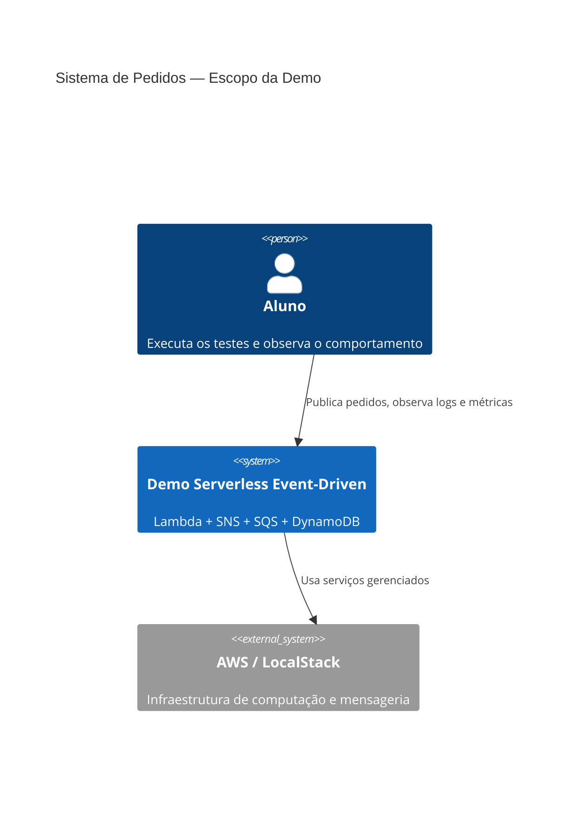
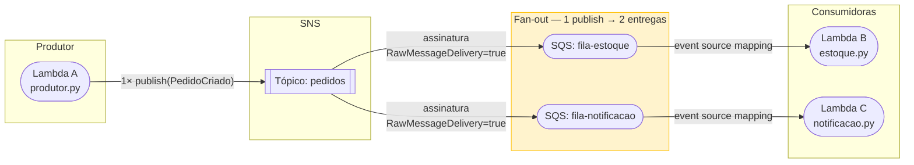
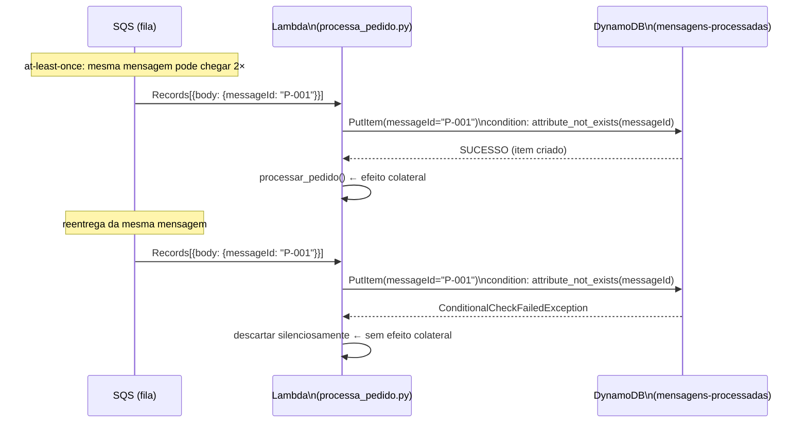
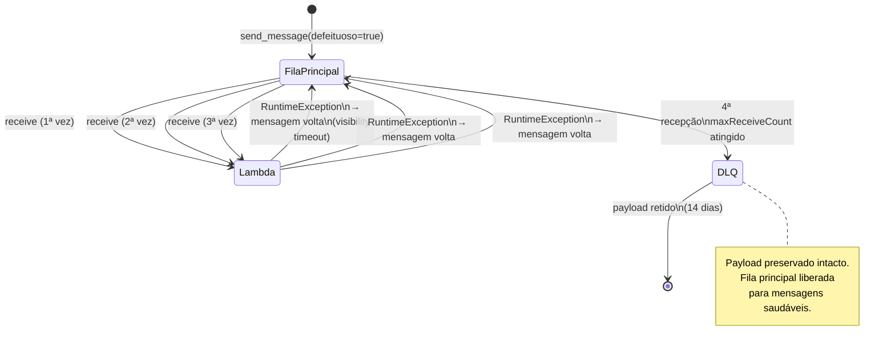

# Arquitetura — Serverless Event-Driven

Visão arquitetural das três demos em Mermaid. Estes diagramas são o "roteiro visual" do código — cada bloco corresponde a um recurso declarado em `infra/template.yaml`.

---

## Contexto (C4 Nível 1)

---

## U1V7 — Topologia Fan-out

> **O fan-out não está no código do produtor.** Ele está nas duas assinaturas SNS→SQS configuradas no template. O produtor faz **uma** chamada `publish`; o SNS entrega **duas** cópias.

---

## U1V8 — Fluxo de Idempotência

---

## U1V9 — Ciclo DLQ

---

## Componentes e Responsabilidades

| Componente | Arquivo | Responsabilidade |
|---|---|---|
| Lambda Produtor | `src/U1V7_fanout/produtor.py` | Publica `PedidoCriado` no SNS — 1 chamada |
| Lambda Estoque | `src/U1V7_fanout/estoque.py` | Consome `fila-estoque` via ESM |
| Lambda Notificação | `src/U1V7_fanout/notificacao.py` | Consome `fila-notificacao` via ESM |
| Lambda Processa Pedido | `src/U1V8_idempotencia/processa_pedido.py` | Processa com PutItem condicional |
| Lambda Consumidora B | `src/U1V9_dlq/consumidora_b.py` | Consome com falha proposital (DLQ demo) |
| SAM Template | `infra/template.yaml` | Declara toda a infraestrutura como código |
| Setup Script | `infra/scripts/setup.sh` | Provisiona recursos no LocalStack via CLI |
| Test Helpers | `tests/helpers.py` | `wait_until`, `deploy_lambda`, `make_client` |
