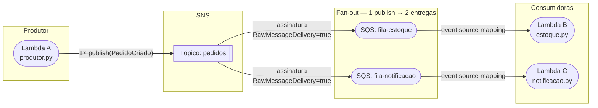

# U1V7 — Fan-out com SNS + SQS

## 1. Objetivo de aprendizagem

Ao terminar esta aula você vai entender **por que** publicar uma vez no [SNS](../glossario.md#sns) e entregar em várias filas [SQS](../glossario.md#sqs) é preferível a enviar individualmente para cada fila, e **como** as assinaturas SNS→SQS implementam isso sem alterar o código do produtor.

**Pré-requisitos** — leia os fundamentos antes de continuar:

1. [Serverless e Lambda](../01-fundamentos/1-serverless-e-lambda.md)
2. [Orientado a eventos](../01-fundamentos/2-orientado-a-eventos.md)
3. [Os quatro serviços](../01-fundamentos/3-os-quatro-servicos.md)
4. [Como ler o código](../01-fundamentos/4-como-ler-o-codigo.md)

---

## 2. O problema: produtor acoplado a N filas

Imagine que ao criar um pedido você precisa acionar dois sistemas independentes: o serviço de estoque e o serviço de notificação. A solução ingênua seria publicar na fila de estoque **e** na fila de notificação dentro do mesmo código do produtor:

```
produtor.py  →  sqs.send_message(fila_estoque)
             →  sqs.send_message(fila_notificacao)
             →  sqs.send_message(fila_xyz)   # a cada novo consumidor, editar aqui
```

Isso é acoplamento direto. Cada novo consumidor exige alterar o produtor. Se um dos envios falhar, os outros já foram — não há atomicidade. E o produtor precisa conhecer os ARNs de todas as filas.

---

## 3. Solução em diagrama

O [SNS](../glossario.md#sns) resolve o problema: o produtor publica **uma** vez no tópico e o SNS entrega para todos os assinantes registrados. Nenhuma linha de código do produtor muda quando você adiciona um novo consumidor.



> **O fan-out não está no código do produtor.** Ele está nas duas assinaturas SNS→SQS configuradas no template. O produtor faz **uma** chamada `publish`; o SNS entrega **duas** cópias.

---

## 4. Código real explicado

### 4.1 `produtor.py` — uma publicação, zero conhecimento das filas

```python
"""
Lambda A — Produtor (U1V7: Fan-out)

Publica um evento PedidoCriado no tópico SNS.
UMA chamada publish → o SNS entrega para N assinantes.
O produtor não conhece as filas; conhece apenas o tópico.
"""
import boto3
import json
import os
import uuid
from datetime import datetime, timezone

# Clientes criados fora do handler: reutilizados entre invocações na mesma instância quente.
# AWS_ENDPOINT_URL é lida automaticamente pelo boto3 — aponta para LocalStack ou AWS Real.
_sns = boto3.client("sns", endpoint_url=os.environ.get("AWS_ENDPOINT_URL"))

TOPIC_ARN = os.environ["TOPIC_ARN"]  # ARN vem de variável de ambiente — nunca hardcoded


def lambda_handler(event, context):
    pedido = {
        "pedidoId": str(uuid.uuid4()),
        "clienteId": "cliente-42",
        "valor": "199.90",
        "criadoEm": datetime.now(timezone.utc).isoformat(),
    }
    payload = json.dumps(pedido)

    # UMA publicação. O fan-out (entrega para múltiplas filas) acontece aqui,
    # no SNS, via assinaturas configuradas — não neste código.
    _sns.publish(TopicArn=TOPIC_ARN, Message=payload)

    print(f"[PRODUTOR] Publicado PedidoCriado: {payload}")
    return pedido["pedidoId"]
```

Pontos-chave:

- O cliente `_sns` é criado **fora** do `lambda_handler` — boa prática para reutilizar a conexão entre invocações na mesma instância quente da Lambda.
- `TOPIC_ARN` vem de variável de ambiente — o produtor não conhece nomes de filas, apenas o ARN do tópico.
- `_sns.publish(TopicArn=TOPIC_ARN, Message=payload)` é a **única** chamada de rede. O fan-out é responsabilidade do SNS, não do produtor.

### 4.2 `estoque.py` — consumidor independente

```python
"""
Lambda B — Consumidora de Estoque (U1V7: Fan-out)

Consome mensagens da fila-estoque disparadas pelo SNS via fan-out.
Com RawMessageDelivery=true na assinatura, body já é o JSON do pedido.
"""


def lambda_handler(event, context):
    for record in event["Records"]:
        # Com "raw message delivery" ativo, body é o JSON puro do PedidoCriado.
        # Sem ele, o SNS envolve o payload em um envelope com campos Type, MessageId, etc.
        print(f"[ESTOQUE] recebido: {record['body']}")
        # Aqui entraria a reserva de estoque — fora do escopo desta demo.
```

O consumidor itera `event["Records"]` — o padrão de todos os triggers SQS→Lambda. Graças ao `RawMessageDelivery: true` na assinatura, `record['body']` já é o JSON puro do pedido. Sem essa configuração, `body` seria um envelope SNS com campos como `Type`, `MessageId`, `Message` — e você precisaria fazer `json.loads(record['body'])['Message']` para chegar ao payload real.

### 4.3 `notificacao.py` — consumidor independente, estrutura idêntica

```python
"""
Lambda C — Consumidora de Notificação (U1V7: Fan-out)

Consome mensagens da fila-notificacao disparadas pelo SNS via fan-out.
Estrutura idêntica à Lambda de Estoque — só o domínio muda.
Essa simetria demonstra o desacoplamento: duas reações ao mesmo fato,
escritas e implantadas de forma completamente independente.
"""


def lambda_handler(event, context):
    for record in event["Records"]:
        print(f"[NOTIFICACAO] recebido: {record['body']}")
        # Aqui entraria o envio de e-mail/push — fora do escopo desta demo.
```

A simetria entre `estoque.py` e `notificacao.py` é intencional: demonstra que cada consumidor é uma unidade independente. Estoque e notificação podem ser versionados, testados e implantados separadamente, sem nenhuma referência um ao outro.

---

## 5. Infraestrutura

O fan-out vive no `template.yaml`, não no código. Há três recursos que trabalham juntos:

```yaml
  # AQUI mora o fan-out: 1 tópico → 2 assinaturas
  AssinaturaEstoque:
    Type: AWS::SNS::Subscription
    Properties:
      TopicArn: !Ref TopicoPedidos
      Protocol: sqs
      Endpoint: !GetAtt FilaEstoque.Arn
      RawMessageDelivery: true  # entrega JSON puro, sem envelope SNS

  AssinaturaNotificacao:
    Type: AWS::SNS::Subscription
    Properties:
      TopicArn: !Ref TopicoPedidos
      Protocol: sqs
      Endpoint: !GetAtt FilaNotificacao.Arn
      RawMessageDelivery: true

  # Política que autoriza o SNS a entregar nas filas (pegadinha clássica via CLI/IaC)
  PoliticaFilas:
    Type: AWS::SQS::QueuePolicy
    Properties:
      Queues:
        - !Ref FilaEstoque
        - !Ref FilaNotificacao
      PolicyDocument:
        Version: '2012-10-17'
        Statement:
          - Effect: Allow
            Principal:
              Service: sns.amazonaws.com
            Action: sqs:SendMessage
            Resource:
              - !GetAtt FilaEstoque.Arn
              - !GetAtt FilaNotificacao.Arn
            Condition:
              ArnEquals:
                aws:SourceArn: !Ref TopicoPedidos
```

> ⚠️ **Ponto de Atenção** — sem a `PoliticaFilas`, o [SNS](../glossario.md#sns) não consegue entregar nas filas [SQS](../glossario.md#sqs). O `publish` vai retornar sucesso (o tópico aceitou a mensagem), mas as filas nunca receberão nada — e nenhuma exceção será lançada. A política `sqs:SendMessage` com condição `ArnEquals: aws:SourceArn: !Ref TopicoPedidos` é obrigatória.

---

## 6. Rodar e observar

```bash
make test-u1v7
```

O teste valida:

1. O produtor publica **uma** mensagem no tópico SNS.
2. A `FilaEstoque` recebe **uma** cópia da mensagem com o JSON puro do pedido.
3. A `FilaNotificacao` recebe **uma** cópia da mesma mensagem, independentemente.
4. As duas filas são consumidas por Lambdas distintas sem compartilhar nenhum estado.

---

## 7. Pontos de Atenção

**O fan-out não está no código do produtor** — está nas assinaturas. Se você ler apenas `produtor.py`, vai ver uma única chamada `_sns.publish`. O roteamento para múltiplas filas é configuração de infraestrutura (`AssinaturaEstoque`, `AssinaturaNotificacao`), não lógica de aplicação.

**`RawMessageDelivery`** ([SNS](../glossario.md#sns) → [SQS](../glossario.md#sqs)):

| Configuração | Conteúdo de `record['body']` |
|---|---|
| `RawMessageDelivery: true` | `{"pedidoId": "...", "clienteId": "...", ...}` |
| `RawMessageDelivery: false` (padrão) | `{"Type": "Notification", "MessageId": "...", "Message": "{\"pedidoId\":...}", ...}` |

Com `false`, o consumidor precisa de `json.loads(record['body'])['Message']` para chegar ao payload real — fonte comum de bugs sutis.

---

## 8. Checklist de compreensão

- [ ] Quantas chamadas `_sns.publish` o `produtor.py` faz para acionar dois consumidores?
- [ ] Onde está definido o fan-out: no código Python ou no `template.yaml`?
- [ ] O que acontece se a `PoliticaFilas` for removida do template?
- [ ] Qual recurso SAM/CloudFormation autoriza o SNS a escrever nas filas SQS?
- [ ] O que `RawMessageDelivery: true` muda no conteúdo de `record['body']` no consumidor?
- [ ] Por que `estoque.py` e `notificacao.py` têm estruturas idênticas? O que isso demonstra sobre desacoplamento?

Pratique: [Exercícios U1V7](../exercicios.md#u1v7)

---

⬅️ [Anterior: Como ler o código](../01-fundamentos/4-como-ler-o-codigo.md) · 📑 [Índice](../index.md) · [Próximo: U1V8 — Idempotência](u1v8-idempotencia.md) ➡️
