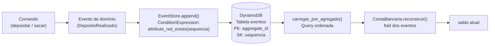

# U2V7 — Event Store com DynamoDB

## 1. Objetivo de aprendizagem

Ao terminar esta aula você vai entender **como** implementar um [event store](../glossario.md#event-store) [append-only](../glossario.md#append-only) sobre o DynamoDB, **por que** a `ConditionExpression` no `PutItem` é a única garantia real de atomicidade na escrita concorrente, e **como** o saldo de uma conta bancária é sempre *derivado* do fold de eventos — nunca gravado diretamente.

**Pré-requisitos:**
- [Event Sourcing — fundamentos](../01-fundamentos/1-event-sourcing.md) — imutabilidade de eventos, fold, agregado
- [CQRS e Projeções](../01-fundamentos/2-cqrs-projecoes.md) — separação de leitura e escrita, projeção de saldo

---

## 2. O problema: sobrescrever estado corrompe o histórico

Sem um event store append-only, a abordagem natural seria gravar o saldo como um número numa tabela e atualizá-lo a cada operação. Isso tem três problemas sérios:

- **Histórico perdido**: se o saldo é `R$ 150`, não há como saber se chegou lá por um depósito de R$ 150 ou por dez depósitos de R$ 15 menos cinco saques de R$ 0.
- **Concorrência sem proteção**: dois processos lendo `saldo = 100` ao mesmo tempo e cada um subtraindo R$ 50 podem gravar `saldo = 50` duas vezes — um dos saques some silenciosamente.
- **Auditoria impossível**: não existe trilha de quem fez o quê e quando — apenas o estado final sobrevive.

A solução é **nunca atualizar o saldo**. Em vez disso, cada operação *acrescenta* um evento à sequência. O saldo é recalculado sob demanda aplicando todos os eventos em ordem — o [replay](../glossario.md#replay).

---

## 3. Solução em diagrama



O fluxo tem dois sentidos independentes: **escrita** (comando → evento → append atômico) e **leitura** (query → fold → saldo). Não há um campo `saldo` persistido em lugar nenhum.

---

## 4. Código real explicado

### 4.1 Eventos de domínio (`eventos.py`)

```python
"""Eventos de domínio da Conta Bancária (U2: Event Sourcing).

Um evento é um fato passado imutável. O estado da conta é derivado
exclusivamente da sequência de eventos — nunca persistido diretamente.
"""
import json
from dataclasses import dataclass
from decimal import Decimal


@dataclass(frozen=True)
class ContaCriada:
    aggregate_id: str


@dataclass(frozen=True)
class DepositoRealizado:
    aggregate_id: str
    valor: Decimal


@dataclass(frozen=True)
class SaqueRealizado:
    aggregate_id: str
    valor: Decimal


# Mapa tipo->classe para desserialização.
_TIPOS = {
    "ContaCriada": ContaCriada,
    "DepositoRealizado": DepositoRealizado,
    "SaqueRealizado": SaqueRealizado,
}


def item_de_evento(evento, sequencia: int, criado_em: int) -> dict:
    """Converte um evento de domínio num item DynamoDB (append-only)."""
    dados = {k: v for k, v in evento.__dict__.items() if k != "aggregate_id"}
    return {
        "aggregate_id": evento.aggregate_id,
        "sequencia": sequencia,
        "tipo": type(evento).__name__,
        "payload": json.dumps(dados, default=str),
        "criado_em": criado_em,
    }


def evento_de_item(item: dict):
    """Reconstrói o evento de domínio a partir do item DynamoDB."""
    classe = _TIPOS[item["tipo"]]
    dados = json.loads(item["payload"])
    if "valor" in dados:
        dados["valor"] = Decimal(str(dados["valor"]))
    return classe(aggregate_id=item["aggregate_id"], **dados)
```

Os três dataclasses são `frozen=True` — imutáveis por construção, como deve ser qualquer fato passado. `item_de_evento` serializa o evento para o formato DynamoDB; `evento_de_item` faz o caminho inverso. O campo `aggregate_id` é excluído do `payload` porque já vive na chave da tabela — não há duplicação.

---

### 4.2 Agregado — fold de eventos (`conta.py`)

```python
"""Agregado ContaBancaria (U2). O saldo é o fold da sequência de eventos."""
from decimal import Decimal

from src.U2_event_sourcing.eventos import (
    ContaCriada, DepositoRealizado, SaqueRealizado,
)


class ContaBancaria:
    def __init__(self):
        self.existe = False
        self.saldo = Decimal("0")

    @classmethod
    def reconstruir(cls, eventos: list) -> "ContaBancaria":
        conta = cls()
        for evento in eventos:
            conta.aplicar(evento)
        return conta

    def aplicar(self, evento) -> None:
        if isinstance(evento, ContaCriada):
            self.existe = True
        elif isinstance(evento, DepositoRealizado):
            self.saldo += evento.valor
        elif isinstance(evento, SaqueRealizado):
            self.saldo -= evento.valor
```

`reconstruir` é o ponto de entrada para leitura de estado: recebe a lista completa de eventos (carregada do DynamoDB) e aplica cada um em ordem. O estado inicial é sempre `existe=False, saldo=0` — não há leitura de um campo de saldo em lugar nenhum. `aplicar` é o fold puro: cada tipo de evento produz exatamente um delta de estado. Passar a mesma lista de eventos sempre produz o mesmo saldo — é uma função determinística.

---

### 4.3 Event Store — append condicional (`repositorio.py`)

```python
"""Event store append-only sobre DynamoDB (U2).

Garante atomicidade do append com ConditionExpression na chave composta:
nunca sobrescreve uma sequência já gravada (concorrência otimista).
"""
import os
import time
from decimal import Decimal

import boto3
from boto3.dynamodb.conditions import Key

from src.U2_event_sourcing.eventos import evento_de_item, item_de_evento


class EventStore:
    def __init__(self, dynamodb_resource=None, nome_tabela: str = "eventos"):
        self._dynamodb = dynamodb_resource or boto3.resource(
            "dynamodb", endpoint_url=os.environ.get("AWS_ENDPOINT_URL")
        )
        self._tabela = self._dynamodb.Table(nome_tabela)

    def _proxima_sequencia(self, aggregate_id: str) -> int:
        resp = self._tabela.query(
            KeyConditionExpression=Key("aggregate_id").eq(aggregate_id),
            ScanIndexForward=False,
            Limit=1,
        )
        itens = resp["Items"]
        return int(itens[0]["sequencia"]) + 1 if itens else 1

    def append(self, aggregate_id: str, evento) -> int:
        sequencia = self._proxima_sequencia(aggregate_id)
        self._gravar_em_sequencia(aggregate_id, evento, sequencia)
        return sequencia

    def _gravar_em_sequencia(self, aggregate_id: str, evento, sequencia: int) -> None:
        item = item_de_evento(evento, sequencia=sequencia, criado_em=int(time.time()))
        # Append atômico: só grava se (aggregate_id, sequencia) ainda não existe.
        self._tabela.put_item(
            Item=item,
            ConditionExpression="attribute_not_exists(sequencia)",
        )

    def carregar_por_agregado(self, aggregate_id: str) -> list:
        resp = self._tabela.query(
            KeyConditionExpression=Key("aggregate_id").eq(aggregate_id),
            ScanIndexForward=True,
        )
        return [evento_de_item(item) for item in resp["Items"]]
```

**`_proxima_sequencia`** faz uma query descendente com `Limit=1` — busca apenas o evento mais recente para obter a sequência atual e incrementar. Eficiente: uma única leitura independente do tamanho do histórico.

**`_gravar_em_sequencia`** é onde a segurança acontece: `ConditionExpression="attribute_not_exists(sequencia)"` instrui o DynamoDB a gravar o item **somente se** não existir ainda um item com aquela chave `(aggregate_id, sequencia)`. A condição e a gravação são uma operação atômica executada no servidor — sem janela de corrida entre checar e gravar.

**`carregar_por_agregado`** faz a query em ordem crescente (`ScanIndexForward=True`) e desserializa cada item de volta ao evento de domínio correspondente. O resultado é exatamente a sequência que `ContaBancaria.reconstruir` espera.

---

### 4.4 Comandos — depositar e sacar (`comandos.py`)

```python
"""Handlers de comando da Conta Bancária (U2). Comandos só ANEXAM eventos."""
import os
import time
from decimal import Decimal

import boto3

from src.U2_event_sourcing.conta import ContaBancaria
from src.U2_event_sourcing.eventos import (
    ContaCriada, DepositoRealizado, SaqueRealizado,
    item_de_evento,
)


class SaldoInsuficiente(Exception):
    """Levantada quando um saque excede o saldo reconstruído."""


def _garantir_conta(store, conta_id: str) -> ContaBancaria:
    eventos = store.carregar_por_agregado(conta_id)
    conta = ContaBancaria.reconstruir(eventos)
    if not conta.existe:
        store.append(conta_id, ContaCriada(aggregate_id=conta_id))
    return conta


def depositar(store, conta_id: str, valor: Decimal) -> None:
    _garantir_conta(store, conta_id)
    store.append(conta_id, DepositoRealizado(aggregate_id=conta_id, valor=valor))


def sacar(store, conta_id: str, valor: Decimal) -> None:
    conta = ContaBancaria.reconstruir(store.carregar_por_agregado(conta_id))
    if valor > conta.saldo:
        raise SaldoInsuficiente(
            f"Saque de {valor} excede o saldo de {conta.saldo} (conta {conta_id})"
        )
    store.append(conta_id, SaqueRealizado(aggregate_id=conta_id, valor=valor))
```

**`depositar`**: garante que a conta existe (cria `ContaCriada` se necessário) e então appenda `DepositoRealizado`. Nunca lê nem escreve um campo `saldo`.

**`sacar`**: reconstrói o saldo atual via fold *antes* de decidir se o saque é válido. Isso garante que a validação opera sobre o estado real — não sobre um cache desatualizado. Se o saldo for suficiente, appenda `SaqueRealizado`.

**`SaldoInsuficiente`**: exceção de domínio, não de infraestrutura. O event store nunca é consultado para validar regras de negócio — essa responsabilidade é do [agregado](../glossario.md#agregado).

---

## 5. Infraestrutura

A tabela do event store está declarada em `infra/template.yaml`:

```yaml
  TabelaEventos:
    Type: AWS::DynamoDB::Table
    Properties:
      TableName: eventos
      BillingMode: PAY_PER_REQUEST
      AttributeDefinitions:
        - AttributeName: aggregate_id
          AttributeType: S
        - AttributeName: sequencia
          AttributeType: N
      KeySchema:
        - AttributeName: aggregate_id
          KeyType: HASH
        - AttributeName: sequencia
          KeyType: RANGE
      StreamSpecification:
        StreamViewType: NEW_IMAGE
```

Pontos importantes da infraestrutura:

- **Chave composta**: `aggregate_id` (PK, tipo `S`) + `sequencia` (SK, tipo `N`). Essa combinação identifica unicamente cada evento. É exatamente sobre ela que a `ConditionExpression="attribute_not_exists(sequencia)"` opera — não há como dois eventos disputarem a mesma sequência dentro do mesmo agregado sem que um dos dois seja rejeitado pelo DynamoDB.
- **`ScanIndexForward`**: como a sort key é numérica, a query em ordem crescente (`True`) retorna os eventos do primeiro ao último — exatamente a ordem que o fold precisa. A query descendente (`False` com `Limit=1`) recupera apenas o evento mais recente para calcular a próxima sequência.
- **DynamoDB Streams** (`StreamViewType: NEW_IMAGE`): cada evento appended à tabela gera um registro no stream contendo o novo item. A Lambda de projeção (`ProjecaoSaldoFunction`) consome esse stream para manter a tabela `saldo_atual` atualizada — o lado de leitura do [CQRS](../glossario.md#cqrs).
- **`BillingMode: PAY_PER_REQUEST`**: sem capacidade provisionada; cobrança por operação.

---

## 6. Rodar e observar

Execute os testes da demo com:

```bash
make test-u2v7
```

Os testes em `tests/test_U2V7_event_store.py` cobrem os cenários essenciais:

| Teste | O que verifica |
|-------|----------------|
| `test_evento_serializa_e_desserializa_preservando_tipo_e_dados` | `item_de_evento` + `evento_de_item` preservam tipo, `aggregate_id` e `valor` com precisão `Decimal` |
| `test_reconstruir_faz_fold_dos_eventos_ate_o_saldo` | Três eventos → `saldo = 70`; o fold é determinístico |
| `test_conta_sem_eventos_nao_existe` | Lista vazia → `existe=False`, `saldo=0`; o agregado começa zerado |
| `test_append_grava_em_sequencia_crescente_e_carrega_ordenado` | `append` retorna 1, 2; `carregar_por_agregado` retorna na mesma ordem |
| `test_append_e_idempotente_por_sequencia_condicional` | Tentar gravar na sequência 1 pela segunda vez levanta `ConditionalCheckFailedException` |
| `test_depositar_e_sacar_atualizam_o_saldo_reconstruido` | `depositar(200)` + `sacar(50)` → saldo reconstruído = 150 |
| `test_sacar_alem_do_saldo_levanta_saldo_insuficiente` | Saque de 999 numa conta com 10 levanta `SaldoInsuficiente` |

---

## 7. Pontos de Atenção

### A janela entre `_proxima_sequencia` e o append é intencional — e protegida

O `append` faz dois passos: (1) consulta a sequência atual, (2) grava na próxima sequência. Entre esses dois passos, um segundo escritor concorrente pode calcular a mesma `proxima_sequencia`. O que acontece?

- O primeiro a gravar no DynamoDB vence: `ConditionExpression="attribute_not_exists(sequencia)"` garante que só um dos dois terá a escrita aceita.
- O segundo recebe `ConditionalCheckFailedException` — ele sabe que colidiu e pode retentar.

Isso é **concorrência otimista**: assume que colisões são raras e resolve na hora em que ocorrem, em vez de travar o agregado preventivamente. Não há `UPDATE` nem transação de banco relacional envolvida — o DynamoDB serializa a decisão atomicamente no servidor.

### `sacar` reconstrói o saldo antes de validar

O `sacar` não usa um saldo em cache — ele chama `store.carregar_por_agregado` e reconstrói o saldo via fold imediatamente antes de decidir se o saque é válido. Isso significa que a validação sempre opera sobre o estado mais recente disponível no event store.

A consequência prática: se dois saques chegarem simultaneamente e o saldo for suficiente para apenas um, o segundo saque vai reconstruir o saldo já modificado pelo primeiro e levantar `SaldoInsuficiente` — sem corrupção, sem saldo negativo.

### Nunca há DELETE ou UPDATE na tabela `eventos`

O event store é [append-only](../glossario.md#append-only) por definição. A política de IAM para a tabela `eventos` em produção deve negar explicitamente `dynamodb:DeleteItem` e `dynamodb:UpdateItem`. Qualquer operação que modifique ou remova eventos históricos invalida todo o histórico derivado deles.

---

## 8. Checklist de compreensão

- [ ] Por que o saldo nunca é gravado diretamente na tabela `eventos`?
- [ ] O que acontece se dois processos calcularem a mesma `_proxima_sequencia` ao mesmo tempo?
- [ ] Por que `ConditionExpression="attribute_not_exists(sequencia)"` é suficiente para proteger a concorrência?
- [ ] O que `ScanIndexForward=True` garante que `ScanIndexForward=False` não garantiria para o fold?
- [ ] Se você apagar todos os eventos de uma conta e reinserir na mesma ordem, o saldo reconstruído muda?
- [ ] Por que `sacar` precisa reconstruir o saldo em vez de receber o saldo como parâmetro?
- [ ] Para que serve o DynamoDB Stream na `TabelaEventos` e o que ele habilita?

Exercícios práticos: [../exercicios.md#u2v7](../exercicios.md#u2v7)

---

⬅️ [Anterior: CQRS e projeções](../01-fundamentos/2-cqrs-projecoes.md) · 📑 [Índice](../index.md) · [Próximo: U2V8 — Replay e snapshots](u2v8-replay-snapshots.md) ➡️
