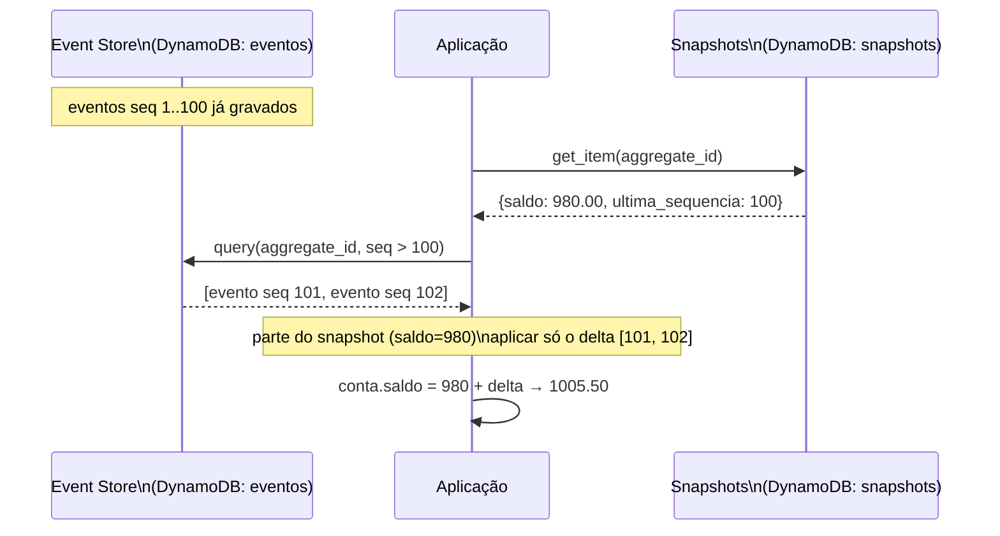

# U2V8 — Replay e Snapshots

## 1. Objetivo de aprendizagem

Ao terminar esta aula você vai entender **como** o [replay](../glossario.md#replay) reconstrói o estado de um agregado a partir do [Event Store](../glossario.md#event-store), **por que** ele é idempotente e **como** os [snapshots](../glossario.md#snapshot) tornam essa reconstrução eficiente quando o histórico de eventos cresce.

**Pré-requisitos:**
- [U2V7 — Event Store](u2v7-event-store.md) — tabela `eventos`, chave `(aggregate_id, sequencia)`, append atômico com `ConditionExpression`
- Conceito de [agregado](../glossario.md#agregado) e [append-only](../glossario.md#append-only)

---

## 2. O problema: reconstrução do zero fica cara

O [Event Sourcing](../glossario.md#event-sourcing) traz uma garantia poderosa: o estado de qualquer agregado pode ser recalculado a qualquer momento, a partir dos eventos. Mas há um custo:

- Uma conta com **3 eventos** reconstrói em microssegundos.
- Uma conta com **50 000 transações** (um cliente ativo por anos) exige ler e processar os 50 000 eventos toda vez que o saldo precisar ser calculado.

Sem nenhuma otimização, o custo de leitura cresce linearmente com o tamanho do histórico. Em DynamoDB isso se traduz em mais RCUs consumidas, mais memória e mais latência a cada chamada.

---

## 3. Solução em diagrama



O ponto-chave: em vez de reler 102 eventos, a aplicação lê **1 snapshot + 2 eventos delta**. O resultado é matematicamente idêntico ao replay completo.

---

## 4. Código real explicado

### 4.1 Replay: `carregar_por_agregado` + `ContaBancaria.reconstruir`

O replay começa no `EventStore`, que consulta todos os eventos de um agregado em ordem crescente de sequência:

```python
    def carregar_por_agregado(self, aggregate_id: str) -> list:
        resp = self._tabela.query(
            KeyConditionExpression=Key("aggregate_id").eq(aggregate_id),
            ScanIndexForward=True,
        )
        return [evento_de_item(item) for item in resp["Items"]]
```

`ScanIndexForward=True` garante a ordem cronológica (seq 1, 2, 3…). A lista retornada é então passada para `ContaBancaria.reconstruir`, que faz o *fold*:

```python
    @classmethod
    def reconstruir(cls, eventos: list) -> "ContaBancaria":
        conta = cls()
        for evento in eventos:
            conta.aplicar(evento)
        return conta

    def aplicar(self, evento) -> None:
        if isinstance(evento, ContaCriada):
            self.existe = True
        elif isinstance(evento, DepositoRealizado):
            self.saldo += evento.valor
        elif isinstance(evento, SaqueRealizado):
            self.saldo -= evento.valor
```

O método `reconstruir` cria uma conta zerada e aplica cada evento em sequência. O estado final é **derivado exclusivamente do histórico** — não há leitura direta de saldo em tabela de estado.

### 4.2 Idempotência do replay

Rodar o replay duas vezes sobre os mesmos eventos produz exatamente o mesmo saldo. Não há efeito colateral: `reconstruir` cria uma instância nova a cada chamada e consome a mesma lista imutável de eventos. O teste confirma isso diretamente:

```python
def test_replay_e_idempotente(tabelas, dynamodb_resource):
    store = EventStore(dynamodb_resource)
    conta_id = f"conta-{uuid.uuid4()}"
    depositar(store, conta_id, Decimal("100"))
    depositar(store, conta_id, Decimal("25"))

    s1 = ContaBancaria.reconstruir(store.carregar_por_agregado(conta_id)).saldo
    s2 = ContaBancaria.reconstruir(store.carregar_por_agregado(conta_id)).saldo
    assert s1 == s2 == Decimal("125")
```

### 4.3 Snapshots: `gravar_snapshot` e `reconstruir_com_snapshot`

O módulo `snapshots.py` completo:

```python
"""Snapshots de agregado (U2). Otimização do replay: parte do último snapshot."""
import os
from decimal import Decimal

import boto3

from src.U2_event_sourcing.conta import ContaBancaria


def _tabela_snapshots(dynamodb_resource):
    return (dynamodb_resource or boto3.resource(
        "dynamodb", endpoint_url=os.environ.get("AWS_ENDPOINT_URL"))).Table("snapshots")


def gravar_snapshot(dynamodb_resource, store, aggregate_id: str) -> None:
    eventos = store.carregar_por_agregado(aggregate_id)
    conta = ContaBancaria.reconstruir(eventos)
    _tabela_snapshots(dynamodb_resource).put_item(Item={
        "aggregate_id": aggregate_id,
        "saldo": conta.saldo,
        "ultima_sequencia": len(eventos),
    })


def reconstruir_com_snapshot(dynamodb_resource, store, aggregate_id: str) -> Decimal:
    resp = _tabela_snapshots(dynamodb_resource).get_item(Key={"aggregate_id": aggregate_id})
    snap = resp.get("Item")
    if not snap:
        return ContaBancaria.reconstruir(store.carregar_por_agregado(aggregate_id)).saldo
    # Aplica só os eventos posteriores ao snapshot.
    todos = store.carregar_por_agregado(aggregate_id)
    delta = todos[int(snap["ultima_sequencia"]):]
    conta = ContaBancaria()
    conta.saldo = Decimal(str(snap["saldo"]))
    conta.existe = True
    for evento in delta:
        conta.aplicar(evento)
    return conta.saldo
```

**`gravar_snapshot`** executa um replay completo no momento em que é chamada, e persiste dois campos na tabela `snapshots`: o `saldo` calculado e a `ultima_sequencia` (quantos eventos existiam naquele instante).

**`reconstruir_com_snapshot`** é onde a otimização acontece. O trecho crítico é:

```python
    todos = store.carregar_por_agregado(aggregate_id)
    delta = todos[int(snap["ultima_sequencia"]):]
```

`todos` traz a lista completa de eventos (incluindo os do snapshot e os posteriores). O slice `[ultima_sequencia:]` descarta os eventos já "absorvidos" pelo snapshot e retorna apenas o delta — os eventos que aconteceram *depois* da fotografia. A conta é inicializada com o saldo do snapshot (`conta.saldo = snap["saldo"]`) e só o delta é aplicado.

Se não existir nenhum snapshot, a função cai no caminho padrão: replay completo. O comportamento é correto nos dois casos.

---

## 5. Rodar e observar

Execute os testes da demo com:

```bash
make test-u2
```

Os dois testes cobrem os cenários essenciais:

| Teste | O que verifica |
|-------|----------------|
| `test_replay_e_idempotente` | Replay executado 2× sobre os mesmos eventos → mesmo saldo nas duas chamadas |
| `test_reconstruir_com_snapshot_bate_com_replay_completo` | Snapshot gravado + evento posterior → `reconstruir_com_snapshot` produz o mesmo saldo que o replay completo |

O segundo teste é a prova de correção mais importante: mesmo partindo do snapshot e aplicando só o delta, o resultado é **matematicamente equivalente** ao replay de ponta a ponta.

---

## 6. Pontos de Atenção

### A pegadinha do UPDATE — append-only protege a reconstrução

O `EventStore` usa `ConditionExpression="attribute_not_exists(sequencia)"` em todo append:

```python
    def _gravar_em_sequencia(self, aggregate_id: str, evento, sequencia: int) -> None:
        item = item_de_evento(evento, sequencia=sequencia, criado_em=int(time.time()))
        # Append atômico: só grava se (aggregate_id, sequencia) ainda não existe.
        self._tabela.put_item(
            Item=item,
            ConditionExpression="attribute_not_exists(sequencia)",
        )
```

Se você tentar sobrescrever um evento já gravado (mesma `aggregate_id` + mesma `sequencia`), o DynamoDB lança `ConditionalCheckFailedException`. Isso não é um erro a ser ignorado — é a garantia estrutural do [append-only](../glossario.md#append-only): o histórico é imutável.

Por que isso importa para o replay? Porque o replay assume que a sequência de eventos nunca muda. Se um evento pudesse ser substituído por outro com o mesmo número de sequência, o replay produziria um saldo diferente dependendo de quando foi executado — a propriedade de idempotência deixaria de existir.

### Snapshot é otimização, não mudança de correção

O snapshot não altera o contrato do sistema: o estado *verdadeiro* de uma conta continua sendo o fold completo de todos os eventos. Se a tabela `snapshots` for apagada inteiramente, `reconstruir_com_snapshot` cai no caminho de fallback (replay completo) e o sistema continua funcionando — mais lento, mas correto.

Isso também significa que você pode regravar snapshots a qualquer momento, ou nunca tirar snapshots de contas com poucos eventos, sem comprometer a consistência.

### O slice parte da sequência, não do índice zero

`todos[int(snap["ultima_sequencia"]):]` usa `ultima_sequencia` como índice de lista, não como número de sequência de evento. Isso funciona porque `ultima_sequencia = len(eventos)` e a lista retornada por `carregar_por_agregado` é indexada a partir de zero em ordem crescente. Se os dois ficarem dessincronizados (por exemplo, por uma migração), o delta seria calculado incorretamente. O snapshot e o event store devem ser sempre tratados como um par.

---

## 7. Checklist de compreensão

- [ ] Por que `ContaBancaria.reconstruir` pode ser chamado N vezes e sempre retornar o mesmo saldo?
- [ ] O que `ScanIndexForward=True` garante na query do Event Store?
- [ ] O que `ultima_sequencia` representa e por que é usado como índice de slice?
- [ ] O que acontece com `reconstruir_com_snapshot` se a tabela `snapshots` estiver vazia?
- [ ] Por que sobrescrever um evento (mesmo número de sequência) quebraria o replay?
- [ ] Snapshot altera a fonte de verdade do sistema? Justifique.

Exercícios práticos: [../exercicios.md#u2v8](../exercicios.md#u2v8)

---

⬅️ [Anterior: U2V7 — Event Store](u2v7-event-store.md) · 📑 [Índice](../index.md) · [Próximo: U2V9 — CQRS e projeção](u2v9-cqrs-projecao.md) ➡️
