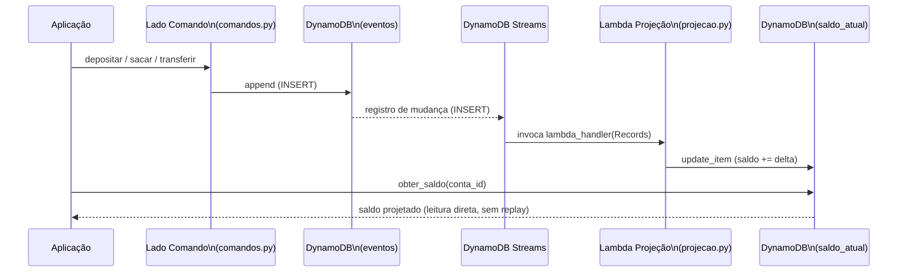

# U2V9 — CQRS e Projeção com DynamoDB Streams

## 1. Objetivo de aprendizagem

Ao terminar esta aula você vai entender **por que** misturar leitura e escrita no mesmo modelo não escala e **como** o padrão [CQRS](../glossario.md#cqrs) resolve isso separando o modelo de escrita (tabela `eventos`) do modelo de leitura (tabela `saldo_atual`), com a [projeção](../glossario.md#projecao) mantida automaticamente por uma Lambda acionada via DynamoDB Streams.

**Pré-requisitos:**
- [U2V7 — Event Store](u2v7-event-store.md) — tabela `eventos`, comandos `depositar` e `sacar`, agregado `ContaBancaria`
- [U2V8 — Replay e Snapshots](u2v8-replay-snapshots.md) — replay por fold, snapshots; esta demo parte do mesmo projeto

---

## 2. O problema: replay por leitura não escala

Nas demos anteriores o estado de uma conta sempre era obtido por **replay**: carregar todos os eventos da tabela `eventos` e dobrar sobre eles até chegar ao saldo atual.

Isso funciona para demos e para contas com poucos eventos. Em produção, uma conta com anos de histórico pode ter milhares de eventos — refazer esse replay a cada consulta de saldo é caro e lento.

Além disso, colocar lógica de leitura e lógica de escrita no mesmo código cria acoplamento desnecessário: qualquer mudança no modelo de escrita pode quebrar consultas, e qualquer consulta nova força uma alteração em código que lida com integridade transacional.

Sem [CQRS](../glossario.md#cqrs):

- Toda consulta de saldo faz replay completo dos eventos — O(n) por leitura.
- O modelo de leitura e o de escrita compartilham a mesma tabela e a mesma classe.
- Adicionar um novo campo de leitura (ex.: total de saques) exige replay customizado a cada consulta.

---

## 3. Solução em diagrama



O lado de **escrita** só conhece a tabela `eventos`. O lado de **leitura** só conhece a tabela `saldo_atual`. O stream faz a ponte de forma assíncrona — é o mecanismo que dispara a [projeção](../glossario.md#projecao) sem nenhum acoplamento direto entre os dois lados.

---

## 4. Código real explicado

### 4.1 Projeção — `projecao.py`

```python
"""Projeção CQRS (U2): mantém a tabela de leitura `saldo_atual`.

A Lambda é acionada por DynamoDB Streams sobre a tabela `eventos`: cada evento
novo ajusta o saldo projetado. O lado de consulta lê apenas de `saldo_atual`.
"""
import json
import os
from decimal import Decimal

import boto3


def _recurso_dynamodb():
    """Cria o recurso DynamoDB lendo as variáveis de ambiente no momento da chamada.

    Inicialização lazy: evita capturar endpoint incorreto em módulo cacheado.
    """
    return boto3.resource("dynamodb", endpoint_url=os.environ.get("AWS_ENDPOINT_URL"))


def _tabela_saldo(dynamodb_resource=None):
    ddb = dynamodb_resource or _recurso_dynamodb()
    return ddb.Table(os.environ.get("TABELA_SALDO", "saldo_atual"))


def lambda_handler(event, context):
    tabela = _tabela_saldo()
    for registro in event["Records"]:
        if registro["eventName"] != "INSERT":
            continue
        novo = registro["dynamodb"]["NewImage"]
        conta_id = novo["aggregate_id"]["S"]
        tipo = novo["tipo"]["S"]
        payload = json.loads(novo["payload"]["S"])
        delta = Decimal(str(payload.get("valor", "0")))
        if tipo == "DepositoRealizado":
            _aplicar(tabela, conta_id, delta)
        elif tipo == "SaqueRealizado":
            _aplicar(tabela, conta_id, -delta)
        elif tipo == "ContaCriada":
            _aplicar(tabela, conta_id, Decimal("0"))


def _aplicar(tabela, conta_id: str, delta: Decimal) -> None:
    tabela.update_item(
        Key={"conta_id": conta_id},
        UpdateExpression="SET saldo = if_not_exists(saldo, :zero) + :d",
        ExpressionAttributeValues={":d": delta, ":zero": Decimal("0")},
    )


def obter_saldo(conta_id: str, dynamodb_resource=None) -> Decimal:
    tabela = _tabela_saldo(dynamodb_resource)
    item = tabela.get_item(Key={"conta_id": conta_id}).get("Item")
    return Decimal(str(item["saldo"])) if item else Decimal("0")
```

**O que cada parte faz:**

`lambda_handler` recebe o lote de registros do DynamoDB Streams. O filtro `if registro["eventName"] != "INSERT": continue` é deliberado: a projeção só reage a eventos novos — atualizações e deleções não fazem parte do modelo append-only do Event Sourcing.

Para cada registro `INSERT`, o handler extrai `aggregate_id`, `tipo` e `payload` diretamente do `NewImage` (a imagem do item tal como foi gravado). O `delta` é calculado com `Decimal` para preservar precisão monetária sem arredondamento de ponto flutuante.

`_aplicar` usa `UpdateExpression` com `if_not_exists(saldo, :zero)`. Esse idioma do DynamoDB inicializa o campo para zero se ainda não existir, e então soma o delta — tudo em uma única operação atômica. Isso garante que a projeção funciona corretamente mesmo quando o primeiro evento de uma conta chega (sem item pré-existente em `saldo_atual`).

`obter_saldo` é a interface de leitura: um simples `GetItem` na tabela `saldo_atual`. Sem replay, sem reconstrição — O(1) independente do número de eventos históricos da conta.

### 4.2 Comando `transferir` — `comandos.py`

```python
def transferir(store, origem: str, destino: str, valor: Decimal) -> None:
    """Saque na origem + depósito no destino numa única transação no event store."""
    conta_origem = ContaBancaria.reconstruir(store.carregar_por_agregado(origem))
    if valor > conta_origem.saldo:
        raise SaldoInsuficiente(
            f"Transferência de {valor} excede o saldo de {conta_origem.saldo} (conta {origem})"
        )
    _garantir_conta(store, destino)

    seq_origem = store._proxima_sequencia(origem)
    seq_destino = store._proxima_sequencia(destino)
    agora = int(time.time())
    item_saque = item_de_evento(SaqueRealizado(aggregate_id=origem, valor=valor), seq_origem, agora)
    item_deposito = item_de_evento(DepositoRealizado(aggregate_id=destino, valor=valor), seq_destino, agora)

    cliente = boto3.client("dynamodb", endpoint_url=os.environ.get("AWS_ENDPOINT_URL"))
    cliente.transact_write_items(TransactItems=[
        {"Put": {"TableName": "eventos", "Item": _para_dynamo(item_saque),
                 "ConditionExpression": "attribute_not_exists(sequencia)"}},
        {"Put": {"TableName": "eventos", "Item": _para_dynamo(item_deposito),
                 "ConditionExpression": "attribute_not_exists(sequencia)"}},
    ])


def _para_dynamo(item: dict) -> dict:
    """Converte um item de resource (tipos Python) para o formato do client low-level."""
    return {
        "aggregate_id": {"S": item["aggregate_id"]},
        "sequencia": {"N": str(item["sequencia"])},
        "tipo": {"S": item["tipo"]},
        "payload": {"S": item["payload"]},
        "criado_em": {"N": str(item["criado_em"])},
    }
```

**Por que `transact_write_items`?**

Uma transferência envolve dois eventos em agregados distintos: `SaqueRealizado` na origem e `DepositoRealizado` no destino. Se fossem dois `PutItem` independentes, uma falha entre eles deixaria o sistema em estado inconsistente — dinheiro saindo da origem sem chegar ao destino (ou vice-versa).

`transact_write_items` envolve os dois `Put` numa única transação ACID do DynamoDB: ou ambos são gravados, ou nenhum é. A `ConditionExpression: attribute_not_exists(sequencia)` em cada `Put` garante que não é possível sobrescrever um evento já existente na mesma posição de sequência — proteção adicional contra corridas de escrita concorrente.

**A separação comando / consulta em prática:**

`transferir` escreve **somente** na tabela `eventos`. Não toca `saldo_atual`. Não sabe que `saldo_atual` existe. Quem atualiza `saldo_atual` é a Lambda de projeção, acionada de forma assíncrona pelo stream — os dois lados evoluem independentemente.

---

## 5. Infraestrutura

```yaml
  TabelaSaldoAtual:
    Type: AWS::DynamoDB::Table
    Properties:
      TableName: saldo_atual
      BillingMode: PAY_PER_REQUEST
      AttributeDefinitions:
        - AttributeName: conta_id
          AttributeType: S
      KeySchema:
        - AttributeName: conta_id
          KeyType: HASH

  ProjecaoSaldoFunction:
    Type: AWS::Serverless::Function
    Properties:
      FunctionName: projecao-saldo
      Handler: projecao.lambda_handler
      CodeUri: ../src/U2_event_sourcing/
      Environment:
        Variables:
          TABELA_SALDO: !Ref TabelaSaldoAtual
      Policies:
        - DynamoDBCrudPolicy:
            TableName: !Ref TabelaSaldoAtual
      Events:
        StreamEventos:
          Type: DynamoDB
          Properties:
            Stream: !GetAtt TabelaEventos.StreamArn
            StartingPosition: LATEST
            BatchSize: 1
```

Pontos-chave da configuração:

| Propriedade | Valor | Motivo |
|---|---|---|
| `KeySchema` de `saldo_atual` | `conta_id` (HASH) | Chave de leitura — acesso O(1) por conta |
| `Stream: !GetAtt TabelaEventos.StreamArn` | ARN da tabela `eventos` | A projeção é acionada por mudanças em `eventos`, não em `saldo_atual` |
| `StartingPosition: LATEST` | `LATEST` | Só processa eventos novos a partir da implantação; histórico já existente não é reprocessado automaticamente |
| `BatchSize: 1` | 1 | Um evento por invocação — simplifica o rastreamento em demos e facilita depuração |
| `DynamoDBCrudPolicy` | sobre `saldo_atual` | A projeção precisa apenas de `UpdateItem` em `saldo_atual`; a política gerenciada do SAM inclui essa permissão |

> A tabela `TabelaEventos` (declarada na demo U2V7) deve ter DynamoDB Streams habilitado com `StreamViewType: NEW_IMAGE` para que o `NewImage` esteja disponível nos registros entregues à Lambda.

---

## 6. Rodar e observar

```bash
make test-u2v9
```

Os testes relevantes para esta demo estão em `tests/test_U2V9_cqrs_projecao.py`:

```python
def test_projecao_reflete_evento_apos_propagacao_do_stream(projecao, dynamodb_resource):
    store = EventStore(dynamodb_resource)
    conta_id = f"conta-{uuid.uuid4()}"
    depositar(store, conta_id, Decimal("80"))

    wait_until(
        lambda: projecao.saldo(conta_id) == Decimal("80"),
        timeout=60,
        message="saldo_atual não refletiu o depósito via DynamoDB Streams",
    )


def test_transferir_move_saldo_entre_contas_atomicamente(projecao, dynamodb_resource):
    store = EventStore(dynamodb_resource)
    origem = f"conta-{uuid.uuid4()}"
    destino = f"conta-{uuid.uuid4()}"
    depositar(store, origem, Decimal("100"))

    transferir(store, origem, destino, Decimal("40"))

    assert ContaBancaria.reconstruir(store.carregar_por_agregado(origem)).saldo == Decimal("60")
    assert ContaBancaria.reconstruir(store.carregar_por_agregado(destino)).saldo == Decimal("40")
```

**O que observar:**

`test_projecao_reflete_evento_apos_propagacao_do_stream` — após `depositar`, o teste **não** lê `saldo_atual` imediatamente. Ele usa `wait_until`, que faz polling com timeout de 60 segundos. Isso ilustra a [consistência eventual](../glossario.md#consistencia-eventual): o evento foi gravado na tabela `eventos`, mas a Lambda de projeção ainda não necessariamente executou. O teste aguarda a propagação assíncrona do stream antes de verificar o valor.

`test_transferir_move_saldo_entre_contas_atomicamente` — verifica que `transact_write_items` gravou os dois eventos de forma consistente: o saldo reconstruído por replay da origem é `60` e o do destino é `40`. Observe que esse teste usa replay (via `ContaBancaria.reconstruir`) para validar o lado de escrita — não lê `saldo_atual` diretamente. Separação de lados em ação.

---

## 7. Pontos de Atenção

### Consistência eventual — o atraso do stream é esperado

Entre o momento em que um evento é gravado em `eventos` e o momento em que a Lambda de projeção atualiza `saldo_atual`, existe um intervalo de tempo. Durante esse intervalo, leituras de `saldo_atual` retornam um valor desatualizado. Isso não é um bug — é a característica definidora da [consistência eventual](../glossario.md#consistencia-eventual).

O design deve documentar (e os clientes da API devem saber) que o saldo lido via `obter_saldo` pode estar alguns milissegundos ou segundos atrás do estado mais recente. Para casos que exigem saldo exato no momento da decisão (ex.: autorização de um saque), use o replay — mas para exibição em dashboard ou extrato resumido, a projeção é suficiente e muito mais rápida.

### A consulta nunca faz replay sob demanda

O lado de leitura ([CQRS](../glossario.md#cqrs)) é representado por `obter_saldo`: um simples `GetItem`. Ele não reconstrói a conta, não chama `ContaBancaria.reconstruir`, não toca a tabela `eventos`. Isso é intencional e é a principal vantagem do padrão — manter esse invariante é responsabilidade do desenvolvedor.

### `transferir` é atômico — falha ruidosamente, não corrompe

`transact_write_items` garante atomicidade: se qualquer `Put` falhar (incluindo violação da `ConditionExpression`), **nenhum** dos dois eventos é gravado. A transação é revertida pelo DynamoDB antes de qualquer dado ser persistido. O código lança a exceção para cima — a chamada falha com erro explícito. Não há estado intermediário, não há saldo negativo, não há dinheiro "no ar" entre as duas contas.

---

## 8. Checklist de compreensão

- [ ] Por que consultar saldo via replay a cada leitura não é adequado para produção?
- [ ] O que é uma [projeção](../glossario.md#projecao) e como a tabela `saldo_atual` se encaixa nesse conceito?
- [ ] Por que `lambda_handler` filtra apenas registros com `eventName == "INSERT"`?
- [ ] O que faz `if_not_exists(saldo, :zero)` na `UpdateExpression` de `_aplicar`?
- [ ] O que acontece com `saldo_atual` se a Lambda de projeção ficar fora do ar por alguns minutos e depois voltar?
- [ ] Por que `transferir` usa `transact_write_items` em vez de dois `PutItem` separados?
- [ ] O que `ConditionExpression: attribute_not_exists(sequencia)` protege dentro da transação?
- [ ] Em que situação seria necessário usar replay em vez de `obter_saldo` para obter o saldo de uma conta?

Pratique com os exercícios: [Exercícios U2V9](../exercicios.md#u2v9).

---

⬅️ [Anterior: U2V8 — Replay e snapshots](u2v8-replay-snapshots.md) · 📑 [Índice](../index.md) · [Próximo: Exercícios](../exercicios.md) ➡️
