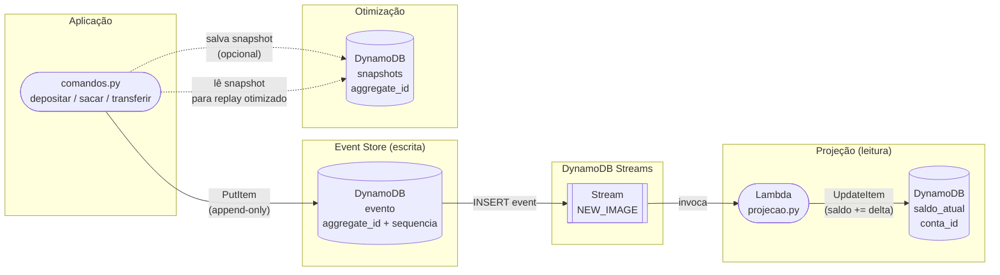
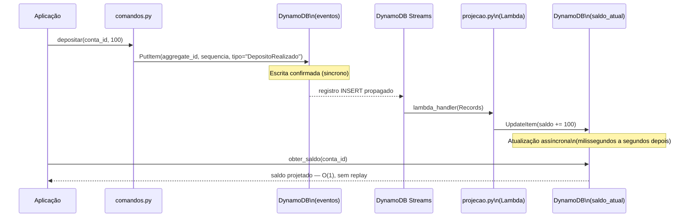

# Arquitetura — Event Sourcing e CQRS

Visão arquitetural consolidada da Unidade 2: os padrões Event Sourcing e CQRS implementados com DynamoDB, DynamoDB Streams e Lambda no LocalStack.

---

## Visão geral do fluxo

No coração da Unidade 2 há uma separação clara entre dois lados:

- **Lado de escrita (comando):** recebe ações do domínio (depositar, sacar, transferir), valida regras de negócio e persiste um novo evento na tabela `eventos` — sem nunca sobrescrever registros anteriores (append-only).
- **Lado de leitura (consulta):** a tabela `saldo_atual` é mantida automaticamente por uma Lambda acionada via DynamoDB Streams; consultas de saldo fazem um simples `GetItem` — sem replay, sem acesso à tabela `eventos`.

O DynamoDB Streams é o mecanismo que conecta os dois lados de forma assíncrona, sem acoplamento direto entre o código de escrita e o de leitura.

---

## Diagrama de fluxo — Comando → Evento → Projeção

---

## Diagrama de sequência — Consistência eventual em prática

> Entre o `PutItem` na tabela `eventos` e a atualização de `saldo_atual` existe um intervalo de tempo: o atraso natural de propagação do DynamoDB Streams. Isso é [consistência eventual](../glossario.md#consistencia-eventual) — comportamento esperado e documentado, não um defeito.

---

## Componentes e Responsabilidades

| Componente | Arquivo | Responsabilidade |
|---|---|---|
| Event Store | `src/U2_event_sourcing/repositorio.py` | Interface de leitura e escrita append-only na tabela `eventos`; impede sobrescrita via `ConditionExpression` |
| Agregado | `src/U2_event_sourcing/conta.py` | Classe `ContaBancaria`; reconstrói saldo por fold dos eventos; não acessa banco diretamente |
| Tipos de evento | `src/U2_event_sourcing/eventos.py` | Dataclasses `ContaCriada`, `DepositoRealizado`, `SaqueRealizado`; definem o esquema do payload |
| Comandos | `src/U2_event_sourcing/comandos.py` | Funções `depositar`, `sacar`, `transferir`; validam regras de negócio e gravam eventos; `transferir` usa `transact_write_items` |
| Snapshots | `src/U2_event_sourcing/snapshots.py` | Grava e carrega snapshots na tabela `snapshots`; permite que o replay parta de um ponto recente |
| Lambda Projeção | `src/U2_event_sourcing/projecao.py` | `lambda_handler` acionado por DynamoDB Streams; atualiza `saldo_atual` para cada evento `INSERT`; expõe `obter_saldo` |
| Tabela `eventos` | `infra/template.yaml` → `TabelaEventos` | Event Store DynamoDB com PK `aggregate_id` + SK `sequencia`; StreamViewType `NEW_IMAGE` habilitado |
| Tabela `saldo_atual` | `infra/template.yaml` → `TabelaSaldoAtual` | Modelo de leitura CQRS; PK `conta_id`; atualizada pela Lambda de projeção |
| Tabela `snapshots` | `infra/template.yaml` → `TabelaSnapshots` | Armazena fotografia periódica do estado; PK `aggregate_id` |
| SAM Template | `infra/template.yaml` | Declara toda a infraestrutura como código; seção U2 a partir da linha 176 |

---

## Decisões de projeto (ADRs)

As três decisões arquiteturais abaixo são válidas para todo o projeto, incluindo a Unidade 2:

| ADR | Decisão |
|---|---|
| [ADR-001 — Python + boto3](../../unidade-1/03-arquitetura/adrs/ADR-001-python-boto3.md) | Handlers Lambda em Python 3.12 com boto3; sem Java, sem JVM, sem build step |
| [ADR-002 — LocalStack](../../unidade-1/03-arquitetura/adrs/ADR-002-localstack.md) | Ambiente local via LocalStack em Docker; zero custo e zero conta AWS para estudar |
| [ADR-003 — endpoint-url](../../unidade-1/03-arquitetura/adrs/ADR-003-endpoint-url.md) | Chaveamento LocalStack ↔ AWS real via variável `AWS_ENDPOINT_URL`; sem if/else no código de produção |

---

⬅️ [Anterior: U2V9 — CQRS e Projeção](../02-demos/u2v9-cqrs-projecao.md) · 📑 [Índice](../index.md) · [Próximo: Exercícios](../exercicios.md) ➡️
