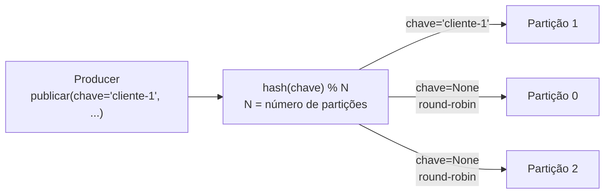

# U3V7 — Produtor Kafka: chave, hash e partição

## 1. Objetivo de aprendizagem

Ao terminar esta aula você vai entender **como** publicar eventos em um tópico Kafka usando o cliente Python `confluent-kafka`, **por que** a [chave](../glossario.md#chave) de uma mensagem determina deterministicamente a [partição](../glossario.md#particao) de destino, e **como** isso garante ordenação por entidade sem sacrificar o paralelismo do sistema.

**Pré-requisitos:**
- [Kafka: log, partições e grupos de consumidores](../01-fundamentos/1-kafka-log-particoes.md) — anatomia do log, papéis de partição e grupo

---

## 2. O problema: ordem por entidade e paralelismo ao mesmo tempo

Num sistema de suporte ao cliente, cada ticket precisa que seus eventos sejam processados **em ordem** — aberto antes de escalado, escalado antes de fechado. Mas há milhares de tickets simultâneos; processá-los sequencialmente num único consumidor seria um gargalo.

A tensão é real:

- **Ordem global** → um único consumidor, sem paralelismo.
- **Paralelismo total** → vários consumidores, sem ordem garantida.

A solução do Kafka é uma terceira via: **ordem por partição**. Todos os eventos de um mesmo ticket caem sempre na mesma partição (via hash da chave), e dentro de uma partição a ordem é garantida. Partições diferentes são processadas em paralelo por consumidores diferentes — sem coordenação.

---

## 3. Solução em diagrama



Com a **mesma chave**, o hash produz sempre o mesmo resultado: todos os eventos de `cliente-1` vão para a mesma partição, seja qual for o momento de publicação. Sem chave (`None`), o Kafka distribui as mensagens entre partições — útil quando a ordem não importa e só se quer paralelismo.

---

## 4. Código real explicado

```python
"""Produtor Kafka (U3V7). Publica eventos; a chave decide a partição."""
import json
import os

from confluent_kafka import Producer
from confluent_kafka.admin import AdminClient, NewTopic

BOOTSTRAP = os.environ.get("KAFKA_BOOTSTRAP", "localhost:9092")


def criar_producer() -> Producer:
    return Producer({"bootstrap.servers": BOOTSTRAP})


def criar_topico(nome: str, particoes: int, bootstrap: str | None = None) -> None:
    admin = AdminClient({"bootstrap.servers": bootstrap or BOOTSTRAP})
    futuros = admin.create_topics([NewTopic(nome, num_partitions=particoes, replication_factor=1)])
    for _, futuro in futuros.items():
        try:
            futuro.result()
        except Exception as e:  # tópico já existe → ok em execuções repetidas
            if "already exists" not in str(e).lower():
                raise


def publicar(producer: Producer, topico: str, chave: str | None, valor: dict) -> int:
    """Publica uma mensagem e retorna a partição em que ela caiu (via delivery report)."""
    particoes: list[int] = []

    def _entrega(err, msg):
        if err is None:
            particoes.append(msg.partition())

    producer.produce(
        topico,
        key=chave.encode() if chave else None,
        value=json.dumps(valor).encode(),
        on_delivery=_entrega,
    )
    producer.flush(10)
    return particoes[0]
```

### `criar_topico`

Cria o tópico via `AdminClient` se ainda não existir. O parâmetro `particoes` define quantas fatias o log terá — mais partições permitem mais consumidores em paralelo. A exceção `"already exists"` é absorvida intencionalmente: idempotência para execuções repetidas (testes, reinicializações).

### `criar_producer`

Retorna um `Producer` configurado apenas com `bootstrap.servers`. Numa aplicação real é aqui que entram configurações de compressão, `linger.ms`, `batch.size` etc. — mas para a demo o mínimo é suficiente.

### `publicar` e o `on_delivery`

Três detalhes críticos trabalhando juntos:

1. **`key=chave.encode()`** — a chave é serializada em bytes. O Kafka aplica `murmur2(key_bytes) % num_partitions` para escolher a partição. Mesma chave → mesmo hash → mesma partição, sempre.

2. **`on_delivery=_entrega`** — callback assíncrono invocado pelo `flush`. É a única forma de saber em qual partição a mensagem efetivamente caiu; o retorno de `produce()` não garante entrega.

3. **`producer.flush(10)`** — força a entrega de todas as mensagens em buffer antes de retornar, com timeout de 10 segundos. Sem `flush()` o producer pode finalizar sem ter enviado nada ao broker; mensagens ficam presas no buffer interno.

---

## 5. Como rodar e observar

### Subir a infraestrutura

```bash
make up
```

Sobe dois contêineres:

| Serviço | Porta | O que é |
|---------|-------|---------|
| Kafka (KRaft) | `9092` | Broker sem ZooKeeper — modo standalone para desenvolvimento |
| Kafka UI | `8080` | Interface web para inspecionar tópicos, partições e mensagens |

Abra [http://localhost:8080](http://localhost:8080) após o `make up`.

### Executar os testes

```bash
make test-u3
```

Os testes em `tests/test_U3_kafka_produtor.py` exercitam os dois cenários centrais:

| Teste | O que verifica |
|-------|----------------|
| `test_mesma_chave_cai_sempre_na_mesma_particao` | 5 mensagens com `chave="cliente-1"` → todas na mesma partição (`len(particoes) == 1`) |
| `test_sem_chave_distribui_entre_particoes` | 30 mensagens sem chave → ao menos 2 partições distintas foram usadas |

### Observar no Kafka UI

1. Acesse **Topics → eventos-suporte**.
2. Na aba **Partitions**, veja o `offset` de cada partição crescer diferentemente dependendo das chaves usadas.
3. Clique em uma partição e filtre por chave para confirmar que `cliente-1` aparece exclusivamente em uma única partição.

---

## 6. Pontos de Atenção

### Ordem é garantida apenas dentro de uma partição

Dois eventos publicados com chaves *diferentes* podem cair em partições distintas — não há garantia de ordem entre eles. Se `TicketAberto(ticket-1)` for para a Partição 1 e `TicketAberto(ticket-2)` for para a Partição 3, não há como dizer qual chegou "primeiro" do ponto de vista global. Modele suas entidades de forma que a ordem relevante seja sempre *intra-entidade* (mesma chave), não *inter-entidade*.

### O teste sem chave é probabilístico

`test_sem_chave_distribui_entre_particoes` publica 30 mensagens e espera que ao menos 2 partições sejam usadas. O Kafka usa sticky partitioning ou round-robin dependendo da versão e configuração — com 30 mensagens e 6 partições a probabilidade de cair em apenas uma é astronomicamente baixa, mas tecnicamente o teste pode falhar num ambiente extremamente congestionado. Não é um teste determinístico como o de chave fixa.

### `flush()` é obrigatório para garantir entrega

O `Producer` do `confluent-kafka` é não-bloqueante por padrão: `produce()` enfileira a mensagem no buffer interno e retorna imediatamente. Sem `flush()` (ou sem um loop de `poll()`), o processo pode terminar sem que o broker tenha recebido nada. Em aplicações de longa duração use `poll(0)` periodicamente; em scripts ou funções de curta duração, chame `flush()` explicitamente antes de encerrar.

### Replication factor 1 é só para desenvolvimento

`replication_factor=1` em `criar_topico` significa que não há réplica: se o broker cair, os dados são perdidos. Em produção use `replication_factor >= 3`.

---

## 7. Checklist de compreensão

- [ ] Por que a mesma chave sempre cai na mesma partição, independente do momento da publicação?
- [ ] O que acontece com a ordem de mensagens de duas chaves *diferentes* num mesmo tópico?
- [ ] Por que `on_delivery` é necessário para obter a partição em que a mensagem caiu?
- [ ] O que acontece se o processo terminar sem chamar `flush()`?
- [ ] Qual é o efeito de aumentar o número de partições de 6 para 12 em mensagens já publicadas?
- [ ] Por que o teste sem chave é probabilístico e o teste com chave fixa é determinístico?

Exercícios práticos: [../exercicios.md#u3v7](../exercicios.md#u3v7)

---

⬅️ [Anterior: IA aplicada a eventos](../01-fundamentos/3-ia-em-eventos.md) · 📑 [Índice](../index.md) · [Próximo: U3V8 — Consumidor](u3v8-kafka-consumidor.md) ➡️
