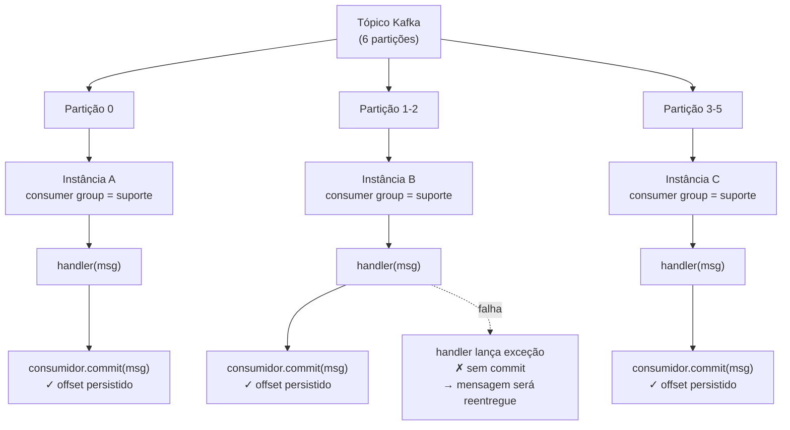

# U3V8 — Consumidor Kafka com commit manual

## 1. Objetivo de aprendizagem

Ao terminar esta aula você vai entender **como** criar um consumidor Kafka com commit manual de [offset](../glossario.md#offset), **por que** esse modelo produz semântica [at-least-once](../glossario.md#semantica-de-entrega), e **como** um [consumer group](../glossario.md#consumer-group) distribui partições entre múltiplas instâncias para escalar o consumo sem perder mensagens.

**Pré-requisitos:**
- [U3V7 — Produtor Kafka](u3v7-kafka-produtor.md) — criação de tópicos, publicação de mensagens, conceito de partição

---

## 2. O problema: escalar o consumo sem perder mensagens em falhas

Um único consumidor processa uma mensagem por vez. Quando o volume cresce, a solução natural é adicionar instâncias. Mas isso traz dois riscos simultâneos:

- **Perda de mensagens**: se o commit do offset acontece *antes* de o processamento terminar e a instância falha no meio do caminho, a mensagem é marcada como consumida sem ter sido realmente processada.
- **Divisão desordenada de partições**: sem um mecanismo de coordenação, duas instâncias podem tentar processar a mesma partição ao mesmo tempo, gerando processamento duplicado descontrolado.

O Kafka resolve os dois com dois mecanismos complementares: **consumer groups** — que garantem que cada partição é atribuída a exatamente uma instância por vez — e **commit manual de offset** — que garante que o progresso só é registrado após o processamento ter sido concluído com sucesso.

---

## 3. Solução em diagrama



Cada partição vai para exatamente uma instância do grupo. O commit só ocorre após o `handler` retornar sem erro. Se o handler lança, o offset fica onde estava e o Kafka reentrega a mensagem — at-least-once.

---

## 4. Código real explicado

### 4.1 Criando o consumidor (`consumidor.py`)

```python
"""Consumidor Kafka (U3V8). Commit manual → semântica at-least-once."""
import os

from confluent_kafka import Consumer

BOOTSTRAP = os.environ.get("KAFKA_BOOTSTRAP", "localhost:9092")


def criar_consumidor(group_id: str) -> Consumer:
    return Consumer({
        "bootstrap.servers": BOOTSTRAP,
        "group.id": group_id,
        "enable.auto.commit": False,       # commit manual: nós controlamos
        "auto.offset.reset": "earliest",   # sem offset commitado → começa do início
    })
```

Três parâmetros determinam o comportamento de consumo:

- **`group.id`**: identifica o [consumer group](../glossario.md#consumer-group). Instâncias com o mesmo `group_id` cooperam — cada partição vai para apenas uma delas. Instâncias com `group_id` diferentes são grupos independentes e recebem *todas* as mensagens cada uma por si.
- **`enable.auto.commit: False`**: desliga o commit automático de [offset](../glossario.md#offset). Sem isso, a biblioteca commitaria o offset em background de forma assíncrona — sem nenhuma garantia de que o processamento terminou. Com `False`, o commit é responsabilidade explícita do código.
- **`auto.offset.reset: "earliest"`**: quando não há offset commitado para o `group_id` naquela partição (primeira vez que esse grupo consome o tópico), começa pelo início do log, não pelas mensagens novas. Garante que nenhuma mensagem publicada antes da primeira conexão seja ignorada.

---

### 4.2 Fazendo o poll (`consumir_uma`)

```python
def consumir_uma(consumidor: Consumer, timeout: float = 2.0):
    """Faz um poll; retorna a mensagem (ou None se nada chegou / só erro)."""
    msg = consumidor.poll(timeout)
    if msg is None or msg.error():
        return None
    return msg
```

`poll` bloqueia até `timeout` segundos esperando uma mensagem. Retorna `None` se o tempo esgotar sem nada chegar; retorna um objeto de erro se houver problema de conexão com o broker. Em ambos os casos a função retorna `None` para o chamador — a lógica de processamento não precisa distinguir os dois cenários.

---

### 4.3 Commit manual após processamento bem-sucedido (`processar_com_commit_manual`)

```python
def processar_com_commit_manual(consumidor: Consumer, handler) -> None:
    """Processa uma mensagem e só commita se o handler NÃO lançar.

    Se o handler lança, o offset não é commitado → a mensagem será reentregue
    (at-least-once). Cabe ao handler ser idempotente.
    """
    msg = consumir_uma(consumidor)
    if msg is None:
        return
    handler(msg)               # se lançar, não chega no commit
    consumidor.commit(msg)     # confirma o processamento
```

Este é o núcleo da [semântica de entrega](../glossario.md#semantica-de-entrega) at-least-once. A sequência é deliberada:

1. `consumir_uma` faz o poll e retorna a mensagem.
2. `handler(msg)` executa a lógica de negócio. Se lançar qualquer exceção, a execução sai da função imediatamente — sem passar pelo `commit`.
3. `consumidor.commit(msg)` persiste o offset no Kafka **somente se** o handler concluiu sem erros.

Consequência direta: se a instância trava, reinicia, ou o handler lança uma exceção, o offset não está commitado. Na próxima sessão — mesmo `group_id` — o Kafka reentrega a partir do último offset commitado. A mensagem pode ser processada mais de uma vez, mas nunca é perdida silenciosamente.

---

## 5. Como rodar e observar

Execute os testes desta demo com:

```bash
make test-u3
```

Os testes em `tests/test_U3_kafka_consumidor.py` cobrem os dois comportamentos essenciais:

| Teste | O que verifica |
|-------|----------------|
| `test_consome_mensagem_publicada` | Publica uma mensagem com chave única e confirma que `consumir_uma` a recupera corretamente com o `sku` esperado |
| `test_at_least_once_sem_commit_rele` | 1ª sessão lê a mensagem mas **não commita** e fecha; 2ª sessão com o mesmo `group_id` relê a mesma mensagem — prova que sem commit o offset não avança |

**Observando no Kafka UI** (disponível em `http://localhost:8080` com o ambiente local rodando):

- **Consumer Groups → suporte**: mostra cada instância ativa, quais partições estão atribuídas a ela e o *consumer lag* (número de mensagens não consumidas) por partição.
- **[Rebalanceamento](../glossario.md#rebalanceamento)**: inicie uma segunda instância com o mesmo `group_id` e observe no painel como as partições se redistribuem. O consumo pausa brevemente enquanto o Kafka reassina as partições.

---

## 6. Pontos de Atenção

### Commit manual = at-least-once; o handler deve ser idempotente

Sem commit automático, a garantia de entrega é at-least-once: em caso de falha após o `handler` ter executado mas antes do `commit` ter sido persistido, a mensagem será reentregue. Isso é correto e esperado. A consequência é que **o handler precisa ser idempotente** — processar a mesma mensagem duas vezes deve produzir o mesmo resultado que processá-la uma vez. Exemplos de como garantir isso: usar o ID da mensagem como chave de idempotência numa tabela de deduplicação, ou garantir que as operações downstream sejam naturalmente idempotentes (como `PUT` em vez de `POST`).

### Sem commit, o offset não avança — nunca

Se o `commit` nunca for chamado — por exemplo, em testes que deliberadamente omitem o commit para verificar o comportamento de reentrega — o Kafka preserva o offset exatamente onde estava. Na próxima vez que uma instância com o mesmo `group_id` conectar, o consumo recomeça do último offset commitado. Isso é o que o teste `test_at_least_once_sem_commit_rele` demonstra: duas sessões distintas, mesmo grupo, mesma mensagem lida nas duas.

### Por que os testes usam um tópico único por execução

```python
TOPICO = f"eventos-suporte-consumidor-{uuid.uuid4()}"
```

O comentário no arquivo de testes explica diretamente:

> *Tópico único por execução: isola o consumidor do backlog acumulado de outros testes/execuções (com earliest, um tópico compartilhado faria o consumidor replayar centenas de mensagens e estourar o orçamento de polls antes de achar a sua).*

Com `auto.offset.reset: "earliest"`, um `group_id` novo numa partição com histórico começa do offset `0` — o primeiro evento já publicado. Se vários testes publicassem no mesmo tópico compartilhado, cada nova execução de testes (com um `group_id` fresco) teria que varrer todas as mensagens de todas as execuções anteriores até encontrar a mensagem do teste corrente. O UUID no nome do tópico garante que cada execução começa com um log vazio.

---

## 7. Checklist de compreensão

- [ ] Por que `enable.auto.commit: False` é necessário para at-least-once?
- [ ] O que acontece com o offset se o handler lança uma exceção em `processar_com_commit_manual`?
- [ ] Dois consumidores com `group_id` diferentes assinando o mesmo tópico recebem as mesmas mensagens ou mensagens distintas?
- [ ] O que dispara um [rebalanceamento](../glossario.md#rebalanceamento) e qual é o efeito observável durante ele?
- [ ] Por que o handler precisa ser idempotente em at-least-once?
- [ ] Se você reiniciar o consumidor sem commitar nenhum offset, o que `auto.offset.reset: "earliest"` garante?
- [ ] Por que usar um UUID no nome do tópico de teste em vez de um nome fixo?

Exercícios práticos: [../exercicios.md#u3v8](../exercicios.md#u3v8)

---

⬅️ [Anterior: U3V7 — Produtor Kafka](u3v7-kafka-produtor.md) · 📑 [Índice](../index.md) · [Próximo: U3V9 — Classificador com IA](u3v9-classificador-ia.md) ➡️
