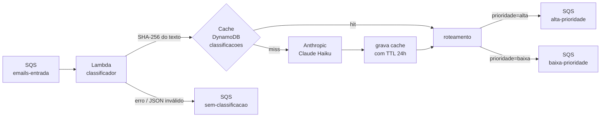

# U3V9 — Classificador de e-mails com IA

## 1. Objetivo de aprendizagem

Ao terminar esta aula você vai entender como integrar um LLM (Claude Haiku via Anthropic) num pipeline orientado a eventos sem deixar o custo crescer sem controle — usando um **cache DynamoDB com TTL** para evitar chamadas redundantes ao modelo — e como manter o código testável offline por meio de injeção de cliente.

**Pré-requisitos:**
- [U3V fundamentos — IA em eventos](../01-fundamentos/3-ia-em-eventos.md) — motivação para usar LLMs em pipelines assíncronos e o padrão de cache semântico

---

## 2. O problema: classificar alto volume com IA sem estourar custo

Sistemas de suporte recebem centenas ou milhares de e-mails por dia. Classificar cada um manualmente não escala. Usar um LLM para isso é natural — mas cada chamada tem custo e latência.

O problema surge quando o mesmo texto (ou textos muito parecidos) chega repetidamente: feriados, incidentes recorrentes, templates de CRM. Chamar o modelo a cada mensagem idêntica é desperdício puro.

Sem cache:

- Toda mensagem que entra na fila dispara uma chamada ao modelo.
- Custo cresce linearmente com volume, mesmo para textos repetidos.
- Um pico de mensagens duplicadas (retry de sistema upstream, reprocessamento) multiplica o custo desnecessariamente.

---

## 3. Solução em diagrama



O fluxo de dados é:
1. Uma mensagem chega em `emails-entrada`.
2. A Lambda calcula o SHA-256 do texto e consulta a tabela `classificacoes`.
3. **Cache hit**: usa o resultado gravado, pula o modelo.
4. **Cache miss**: chama o Anthropic, grava o resultado com TTL de 24 horas.
5. O roteamento envia para `alta-prioridade` ou `baixa-prioridade`.
6. Qualquer falha (JSON inválido, erro de API) envia para `sem-classificacao` — a mensagem não é perdida.

---

## 4. Código real explicado

```python
"""Classificador de eventos com IA (U3V9).

Recebe e-mails de suporte via SQS, classifica com a Anthropic (Claude Haiku),
cacheia o resultado em DynamoDB (evita custo em textos repetidos) e roteia
para a fila de prioridade correspondente.
"""
import hashlib
import json
import os
import time

import boto3

MODELO = "claude-haiku-4-5"
TTL_SEGUNDOS = 24 * 3600

# Override de cliente LLM para testes (injeção). Em produção fica None.
_override_llm = None


def usar_cliente_llm(cliente) -> None:
    """Injeta um cliente LLM (usado nos testes). Passe None para usar o real."""
    global _override_llm
    _override_llm = cliente


def _cliente_llm():
    if _override_llm is not None:
        return _override_llm
    import anthropic
    return anthropic.Anthropic()  # lê ANTHROPIC_API_KEY do ambiente


def _sqs():
    return boto3.client("sqs", endpoint_url=os.environ.get("AWS_ENDPOINT_URL"))


def _tabela_cache():
    dynamodb = boto3.resource("dynamodb", endpoint_url=os.environ.get("AWS_ENDPOINT_URL"))
    return dynamodb.Table(os.environ.get("TABELA_CACHE", "classificacoes"))


def _url_fila(sqs, nome: str) -> str:
    return sqs.get_queue_url(QueueName=nome)["QueueUrl"]


def classificar(texto: str, cliente=None) -> dict:
    """Chama o LLM e devolve {'prioridade': ..., 'categoria': ...} validado."""
    cliente = cliente or _cliente_llm()
    resp = cliente.messages.create(
        model=MODELO,
        max_tokens=100,
        messages=[{
            "role": "user",
            "content": (
                "Classifique o e-mail de suporte abaixo. Responda APENAS um JSON "
                'no formato {"prioridade": "alta|baixa", "categoria": "tecnico|comercial"}.\n\n'
                f"E-mail: {texto}"
            ),
        }],
    )
    dados = json.loads(resp.content[0].text)
    return {"prioridade": dados["prioridade"], "categoria": dados["categoria"]}


def lambda_handler(event, context):
    sqs = _sqs()
    tabela = _tabela_cache()
    for record in event["Records"]:
        texto = record["body"]
        hash_texto = hashlib.sha256(texto.encode()).hexdigest()

        cacheado = tabela.get_item(Key={"hash_texto": hash_texto}).get("Item")
        if cacheado:
            classificacao = {"prioridade": cacheado["prioridade"], "categoria": cacheado["categoria"]}
        else:
            try:
                classificacao = classificar(texto)
            except Exception as e:  # JSON inválido, erro de API, etc.
                print(f"[CLASSIFICADOR] Falha ao classificar: {e}")
                sqs.send_message(QueueUrl=_url_fila(sqs, "sem-classificacao"), MessageBody=texto)
                continue
            tabela.put_item(Item={
                "hash_texto": hash_texto,
                "prioridade": classificacao["prioridade"],
                "categoria": classificacao["categoria"],
                "expira_em": int(time.time()) + TTL_SEGUNDOS,
            })

        fila = "alta-prioridade" if classificacao["prioridade"] == "alta" else "baixa-prioridade"
        sqs.send_message(QueueUrl=_url_fila(sqs, fila), MessageBody=texto)
```

**O que cada parte faz:**

`usar_cliente_llm` / `_cliente_llm` — padrão de injeção de dependência simples. Em produção, `_override_llm` é `None` e a função importa `anthropic` e cria o cliente real (que lê `ANTHROPIC_API_KEY` do ambiente). Nos testes, `usar_cliente_llm(fake)` substitui esse cliente por um objeto controlado — sem nenhuma chave de API, sem rede. O `import anthropic` fica dentro do `if`, portanto nunca é executado durante os testes (a biblioteca nem precisa estar instalada no ambiente de teste).

`classificar` — envia o texto ao modelo e faz `json.loads` na resposta. O prompt instrui o modelo a responder **apenas** um JSON no formato esperado. Se a resposta não for JSON válido, `json.loads` lança exceção — capturada pelo `lambda_handler`.

`lambda_handler` — núcleo do pipeline econômico:

1. Calcula o **SHA-256** do texto. Textos idênticos sempre produzem o mesmo hash — é a chave do cache.
2. Consulta a tabela `classificacoes` pelo hash antes de chamar o modelo.
3. **Cache hit**: reconstrói `classificacao` do item gravado. Custo: zero chamadas ao LLM.
4. **Cache miss**: chama `classificar`, e em caso de sucesso grava o resultado com `expira_em = agora + 24h`. O DynamoDB apaga o item automaticamente após o [TTL](../glossario.md#cache-classificacao).
5. Qualquer exceção no bloco `try` (JSON inválido, timeout de rede, erro de API) desvia a mensagem para `sem-classificacao` via `continue` — o loop segue para o próximo `record` sem interromper o lote.
6. O roteamento final é uma única linha: `"alta-prioridade"` se `prioridade == "alta"`, `"baixa-prioridade"` caso contrário.

---

## 5. Infraestrutura

```yaml
# ─────────────────────────────────────────────────────────────────────────────
# U3V9 — IA classificando eventos
# ─────────────────────────────────────────────────────────────────────────────

  FilaEmailsEntrada:
    Type: AWS::SQS::Queue
    Properties:
      QueueName: emails-entrada

  FilaAltaPrioridade:
    Type: AWS::SQS::Queue
    Properties:
      QueueName: alta-prioridade

  FilaBaixaPrioridade:
    Type: AWS::SQS::Queue
    Properties:
      QueueName: baixa-prioridade

  FilaSemClassificacao:
    Type: AWS::SQS::Queue
    Properties:
      QueueName: sem-classificacao

  TabelaClassificacoes:
    Type: AWS::DynamoDB::Table
    Properties:
      TableName: classificacoes
      BillingMode: PAY_PER_REQUEST
      AttributeDefinitions:
        - AttributeName: hash_texto
          AttributeType: S
      KeySchema:
        - AttributeName: hash_texto
          KeyType: HASH
      TimeToLiveSpecification:
        AttributeName: expira_em
        Enabled: true

  ClassificadorFunction:
    Type: AWS::Serverless::Function
    Properties:
      FunctionName: classificador
      Handler: classificador.lambda_handler
      CodeUri: ../src/U3_ia/
      Timeout: 30
      Environment:
        Variables:
          TABELA_CACHE: !Ref TabelaClassificacoes
          ANTHROPIC_API_KEY: ""
      Policies:
        - DynamoDBCrudPolicy:
            TableName: !Ref TabelaClassificacoes
        - SQSSendMessagePolicy:
            QueueName: alta-prioridade
        - SQSSendMessagePolicy:
            QueueName: baixa-prioridade
        - SQSSendMessagePolicy:
            QueueName: sem-classificacao
      Events:
        FilaEntrada:
          Type: SQS
          Properties:
            Queue: !GetAtt FilaEmailsEntrada.Arn
            BatchSize: 1
```

Pontos-chave da configuração:

| Recurso / Propriedade | Valor | Motivo |
|---|---|---|
| `TabelaClassificacoes.KeySchema` | `hash_texto` (HASH) | SHA-256 como chave — acesso O(1) exato |
| `TimeToLiveSpecification` | `expira_em`, habilitado | DynamoDB apaga itens expirados automaticamente, sem custo de gestão |
| `Timeout: 30` | 30 segundos | Chamadas ao Anthropic podem levar alguns segundos; o padrão de 3s é insuficiente |
| `ANTHROPIC_API_KEY: ""` | vazio no template | A chave real é injetada via Secrets Manager ou variável de ambiente no deploy real |
| `BatchSize: 1` | 1 | Um e-mail por invocação — facilita rastreamento e isolamento de falhas |
| `SQSSendMessagePolicy` × 3 | alta, baixa, sem-classificacao | A Lambda precisa apenas de `SendMessage` nas três filas de saída |

> `FilaEmailsEntrada` aciona a Lambda via Event Source Mapping ([ESM](../../unidade-1/glossario.md#esm)). As filas de saída (`alta-prioridade`, `baixa-prioridade`, `sem-classificacao`) são destinos de roteamento — a Lambda envia para elas diretamente via SDK.

---

## 6. Como rodar e observar

```bash
make test-u3v9
```

Os testes para esta demo estão em `tests/test_U3V9_ia_classificador.py`. Eles **não precisam de chave Anthropic** — injetam um `ClienteFake` via `usar_cliente_llm`:

```python
class FakeMensagens:
    def __init__(self, pai):
        self._pai = pai

    def create(self, **kwargs):
        self._pai.chamadas += 1
        texto = json.dumps({"prioridade": self._pai.prioridade, "categoria": "tecnico"})
        return type("Resp", (), {"content": [type("Bloco", (), {"text": texto})()]})()


class ClienteFake:
    """Imita anthropic.Anthropic(): .messages.create(...).content[0].text é JSON."""
    def __init__(self, prioridade="alta"):
        self.prioridade = prioridade
        self.chamadas = 0
        self.messages = FakeMensagens(self)
```

O `ClienteFake` imita a interface `anthropic.Anthropic()`: tem `.messages.create(...)` que devolve um objeto com `.content[0].text` — exatamente o que `classificar` consome. O campo `chamadas` conta quantas vezes o modelo foi de fato consultado, permitindo verificar o comportamento do cache.

**Os três testes reais:**

`test_classifica_e_roteia_para_alta_prioridade` — injeta um `ClienteFake(prioridade="alta")`, envia uma mensagem única e verifica que ela chegou em `alta-prioridade`. Confirma também que `fake.chamadas == 1` (o modelo foi chamado exatamente uma vez).

`test_cache_evita_segunda_chamada_ao_llm` — envia o **mesmo texto duas vezes**. Verifica que `fake.chamadas == 1`: a segunda invocação resolveu pelo cache e não chamou o modelo. Este é o teste central do padrão econômico.

`test_json_invalido_vai_para_sem_classificacao` — injeta um fake que retorna `"isto não é json"` em vez de JSON válido. Verifica que a mensagem foi roteada para `sem-classificacao` — o pipeline não trava, não perde a mensagem e não propaga a exceção.

---

## 7. Pontos de Atenção

### Cache e [TTL](../glossario.md#cache-classificacao) — o mecanismo de controle de custo

O cache usa o SHA-256 do texto como chave. Textos **exatamente iguais** (byte a byte) têm o mesmo hash e acertam o cache. Textos ligeiramente diferentes (um espaço a mais, maiúscula diferente) têm hashes distintos e são tratados como novos — isso é esperado e correto para um cache exato.

O `expira_em` grava o timestamp Unix de expiração (`agora + 24h`). O DynamoDB verifica periodicamente e apaga os itens após essa data — a tabela não cresce indefinidamente. Em volumes altos, esse TTL de 24h captura a maioria dos reenvios e retries sem acumular classificações obsoletas.

### JSON inválido vai para `sem-classificacao` — nunca descarte silenciosamente

Quando o modelo retorna algo que não é JSON válido (resposta em linguagem natural, recusa, truncamento por `max_tokens`), `json.loads` lança `json.JSONDecodeError`. O bloco `try/except` captura esse e qualquer outro erro de API, loga o problema e envia a mensagem original para `sem-classificacao`. Isso garante que **nenhuma mensagem é perdida**: ela pode ser revisada manualmente ou reprocessada depois.

### Rodar com a Anthropic real — duas exigências

Para usar o modelo real em vez do fake:

1. Defina `ANTHROPIC_API_KEY` no ambiente da Lambda (via Secrets Manager, Parameter Store ou variável de ambiente direta).
2. Confirme o identificador do modelo Haiku vigente na data do deploy. O código usa `MODELO = "claude-haiku-4-5"` — esse ID pode mudar conforme novas versões são lançadas. Consulte a documentação da Anthropic para o ID correto antes de fazer o deploy em produção.

---

## 8. Checklist de compreensão

- [ ] Por que o cache usa SHA-256 do texto em vez do texto completo como chave?
- [ ] O que acontece com o item no DynamoDB quando `expira_em` é atingido?
- [ ] Por que o `import anthropic` fica dentro de `_cliente_llm` e não no topo do arquivo?
- [ ] O que `fake.chamadas == 1` prova no teste `test_cache_evita_segunda_chamada_ao_llm`?
- [ ] Por que textos ligeiramente diferentes (um espaço a mais) não acertam o cache?
- [ ] O que acontece com uma mensagem cujo texto foi classificado ontem e o item expirou hoje?
- [ ] Por que `sem-classificacao` existe como fila separada em vez de simplesmente ignorar o erro?
- [ ] Como você ajustaria o sistema para que o cache funcione mesmo com pequenas variações de texto?

Pratique com os exercícios: [Exercícios U3V9](../exercicios.md#u3v9).

---

⬅️ [Anterior: U3V8 — Consumidor Kafka](u3v8-kafka-consumidor.md) · 📑 [Índice](../index.md) · [Próximo: Exercícios](../exercicios.md) ➡️
