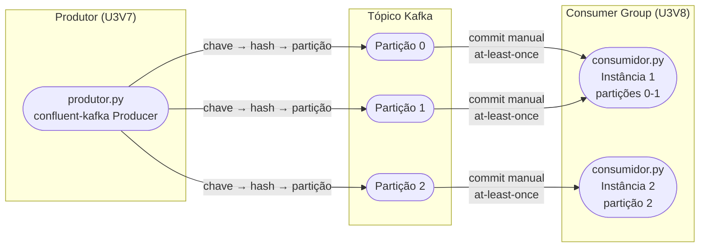
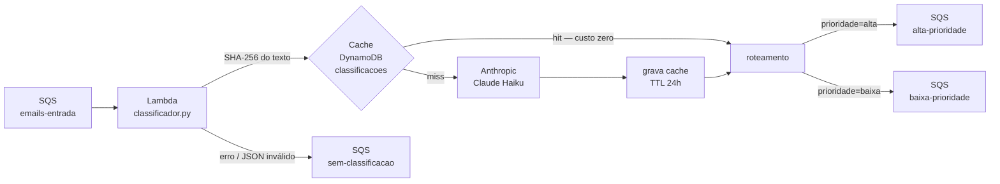

# Arquitetura — Visão Completa da Unidade 3

Este módulo apresenta a visão arquitetural consolidada da Unidade 3: a topologia Kafka das demos U3V7/U3V8 e o pipeline de classificação com IA da demo U3V9, reunidos em diagramas e na tabela de componentes.

---

## Topologia Kafka — Produtor, Partições e Consumer Group

**O que o diagrama mostra:**

- O produtor escolhe a partição com base no hash da chave (`chave.encode()`). Mensagens com a mesma chave sempre vão para a mesma partição — garantia de ordenação por chave.
- O consumer group distribui as partições entre as instâncias disponíveis. Se há mais instâncias do que partições, as instâncias excedentes ficam ociosas.
- O commit manual (`enable.auto.commit: False`) garante que o offset só avança após o processamento bem-sucedido — semântica at-least-once.

---

## Pipeline de IA — Classificação com Cache e Roteamento SQS

**O que o diagrama mostra:**

- A fila `emails-entrada` aciona a Lambda via Event Source Mapping (ESM) — uma mensagem por invocação (`BatchSize: 1`).
- O hash SHA-256 do texto é a chave do cache: textos idênticos acertam o cache e nunca chegam ao modelo.
- O TTL de 24 horas garante que a tabela `classificacoes` não cresça indefinidamente.
- O ramo de erro (`sem-classificacao`) preserva mensagens que falharam na classificação — nada é descartado silenciosamente.

---

## Componentes e Responsabilidades

| Componente | Arquivo / Serviço | Responsabilidade |
|---|---|---|
| Kafka broker (KRaft) | `docker-compose.yml` — serviço `kafka` | Broker de mensagens persistente, sem ZooKeeper; porta 9092 |
| Kafka UI | `docker-compose.yml` — serviço `kafka-ui` | Interface web para inspecionar tópicos e mensagens; porta 8080 |
| LocalStack | `docker-compose.yml` — serviço `localstack` | Emula SQS, DynamoDB e Lambda localmente; porta 4566 |
| Produtor Kafka | `src/U3_kafka/produtor.py` | Publica eventos com `confluent-kafka`; chave determina a partição |
| Consumidor Kafka | `src/U3_kafka/consumidor.py` | Consome com commit manual; semântica at-least-once |
| Lambda Classificador | `src/U3_ia/classificador.py` | Recebe e-mails da fila, consulta cache, chama Anthropic no miss, roteia |
| Fila `emails-entrada` | `infra/template.yaml` — `FilaEmailsEntrada` | Entrada do pipeline de IA; aciona `ClassificadorFunction` via ESM |
| Fila `alta-prioridade` | `infra/template.yaml` — `FilaAltaPrioridade` | Destino de e-mails classificados como alta prioridade |
| Fila `baixa-prioridade` | `infra/template.yaml` — `FilaBaixaPrioridade` | Destino de e-mails classificados como baixa prioridade |
| Fila `sem-classificacao` | `infra/template.yaml` — `FilaSemClassificacao` | Destino de mensagens que falharam na classificação (erro de API, JSON inválido) |
| Cache DynamoDB | `infra/template.yaml` — `TabelaClassificacoes` | Armazena resultados por hash SHA-256 com TTL de 24h |
| SAM Template | `infra/template.yaml` | Declara toda a infraestrutura como código |

---

## Decisões (ADRs)

As decisões de projeto que afetam toda a trilha — escolha do Python/boto3, uso do LocalStack, padrão de endpoint URL — estão documentadas nos ADRs compartilhados:

- [ADR-001 — Python + boto3](../../unidade-1/03-arquitetura/adrs/ADR-001-python-boto3.md)
- [ADR-002 — LocalStack](../../unidade-1/03-arquitetura/adrs/ADR-002-localstack.md)
- [ADR-003 — Endpoint URL](../../unidade-1/03-arquitetura/adrs/ADR-003-endpoint-url.md)

---

⬅️ [Anterior: U3V9 — Classificador com IA](../02-demos/u3v9-classificador-ia.md) · 📑 [Índice](../index.md) · [Próximo: Exercícios](../exercicios.md) ➡️
